<div align="center">


# <code>❯ JL Forum Frontend Application</code> 💬

<em>A responsive and interactive web application for the **JL Forum**, built with modern web technologies.</em>

<em>Built with the tools and technologies:</em>


<br>


<br>


</div>
<br>

---

## Table of Contents

- [Table of Contents](#table-of-contents)
- [Overview](#overview)
- [Features](#features)
- [Project Structure](#project-structure)
  - [Project Index](#project-index)
- [Getting Started](#getting-started)
  - [Prerequisites](#prerequisites)
  - [Installation](#installation)
  - [Usage](#usage)
- [Roadmap](#roadmap)
- [License](#license)
- [Acknowledgments](#acknowledgments)

---

## Overview 🌐

The JL Forum Frontend Application serves as the **intuitive and responsive user interface** for interacting with the JL Forum Backend API. Built with modern React principles and a rich set of libraries, it provides users with a seamless experience for Browse, creating, and engaging with forum content. This application focuses on delivering a dynamic user experience, from secure authentication to interactive content display and management.

---

## Features ✨

The JL Forum Frontend provides a comprehensive set of features designed to enhance user engagement and content accessibility:

- **User Authentication & Authorization**:
  - Secure user registration and login with local accounts.
  - Seamless social login integration via Google, Kakao, and Naver.
  - Protected routes ensuring only authenticated users can access specific content or perform actions.
- **Dynamic Forum Content Display**:
  - Browse posts categorized by various topics.
  - View detailed post content, including associated images.
  - Interactive liking functionality on posts.
- **Post and Category Management**:
  - Create, edit, and delete forum posts.
  - Upload images directly when creating or updating posts.
  - Select and manage categories for organized content.
- **Responsive Design**:
  - Optimized layout and components for a consistent user experience across various devices (desktops, tablets, mobile phones) using Ant Design and Styled Components.
- **Internationalization (i18n)**:
  - Support for multiple languages, allowing users to switch between different linguistic versions of the application interface.
- **Robust Form Handling**:
  - Utilizes Formik and Yup for efficient form state management, validation, and error handling for user inputs.
- **API Communication**:
  - Seamless interaction with the JL Forum Backend API using Axios for data fetching and submission.
- **Cloud Integration (AWS Amplify)**:
  - Leveraging AWS services for robust backend infrastructure for services like authentication and storage.
- **State Management**:
  - Efficient global state management for application data using Redux.

---

## Screenshots

This section provides a visual overview of the application's key features and layout.

### Homepage - Main Sections

- **Header and Most Recent Section:**
  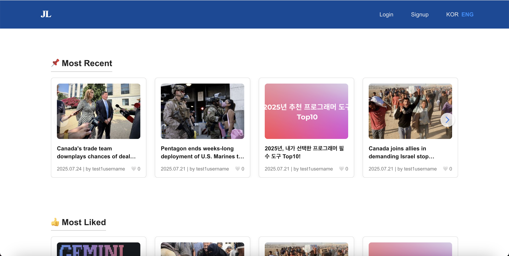

- **Most Liked Section:**
  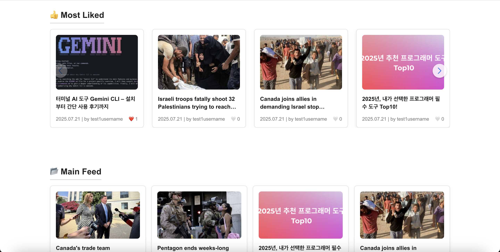

- **Main Feed Section:**
  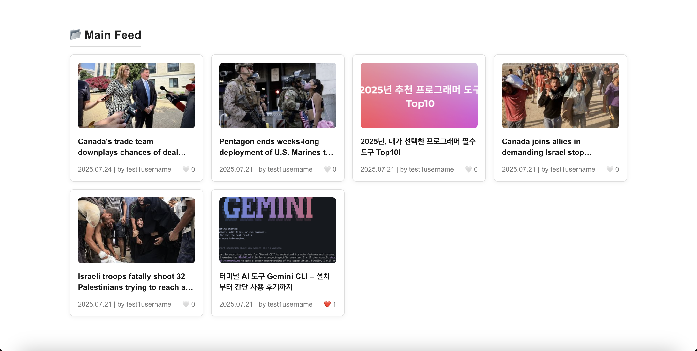

- **Pagination and Footer:**
  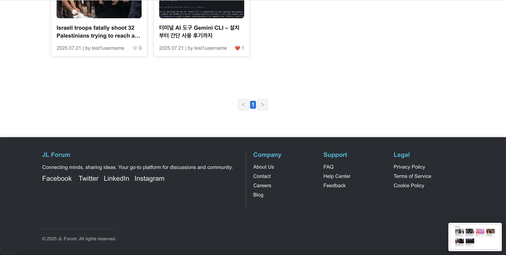

- **Logged-in Header:**
  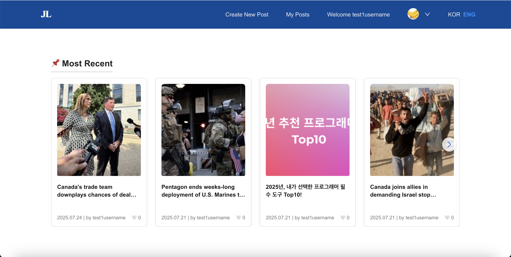

  ### User Authentication

This section provides screenshots of the application's user authentication and account recovery flows.

- **Main Login Page:**
  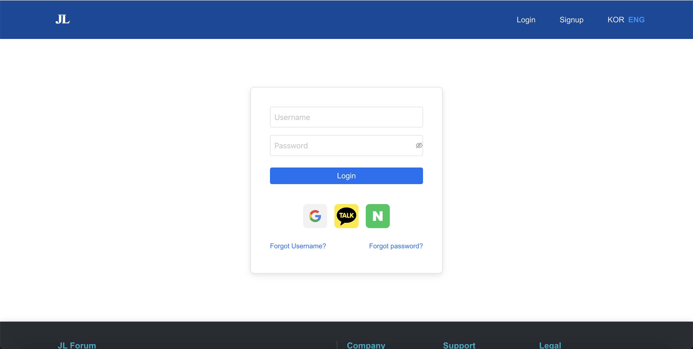

- **Google Login Integration:**
  

- **Kakao Login Integration:**
  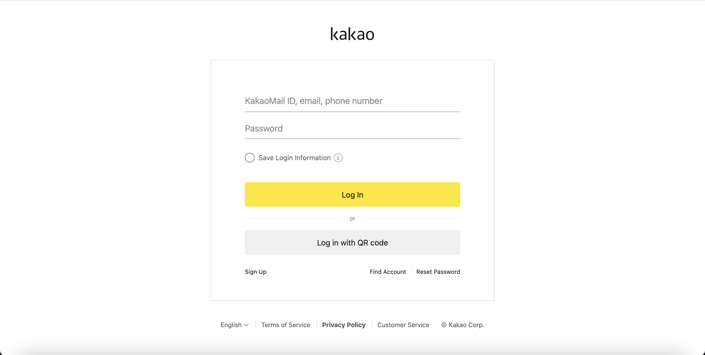

- **User Sign Up Page:**
  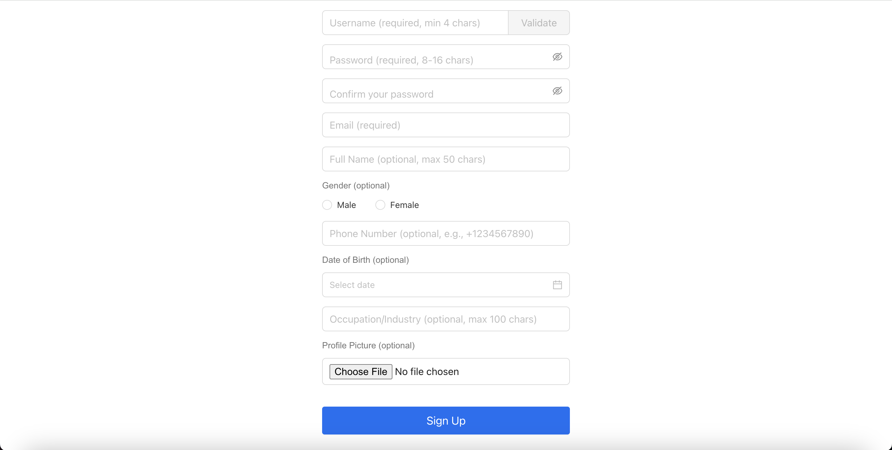

- **Forgot Username Page:**
  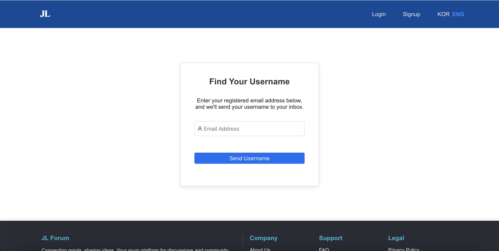

- **Forgot Password Page:**
  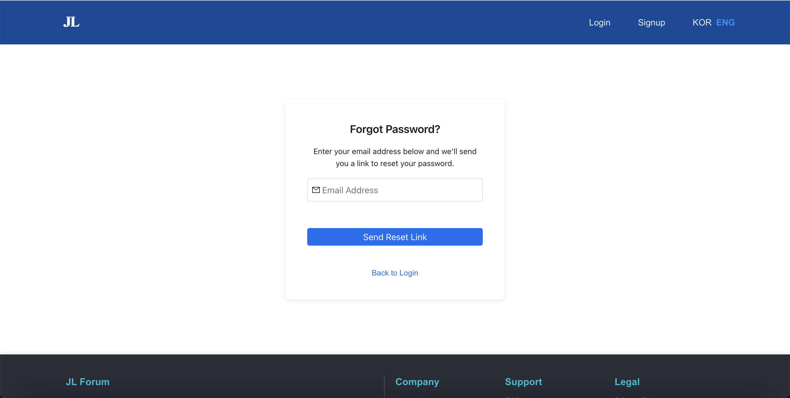

  ### Content Creation and Management

This section illustrates the functionality for creating and editing posts within the application.

- **Create New Post Page:**
  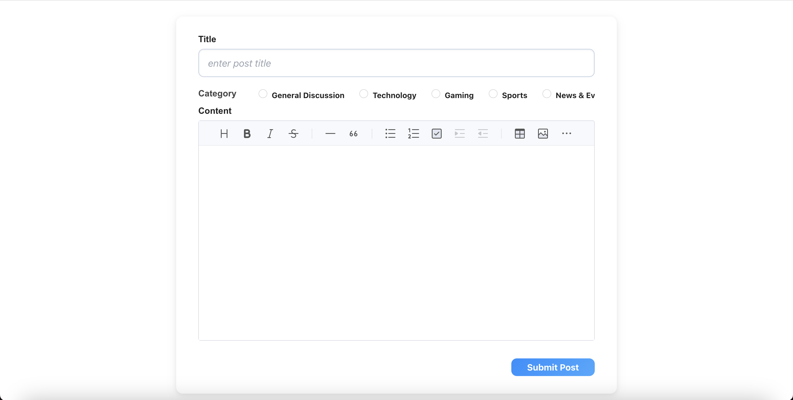

- **Edit Post Page (Image Included):**
  

- **Edit Post Page (Text Content):**
  

### Post Detail View

This section showcases how individual posts are displayed, including content and user interaction options.

- **Post Detail Page (Full View):**
  

- **Post Detail Page (Edit/Delete Options):**
  

### User Profile and Settings

This section details the user's profile view and the options available for editing personal information.

- **User Profile View:**
  

- **Edit Profile Page (Top Section):**
  

- **Edit Profile Page (Bottom Section):**
  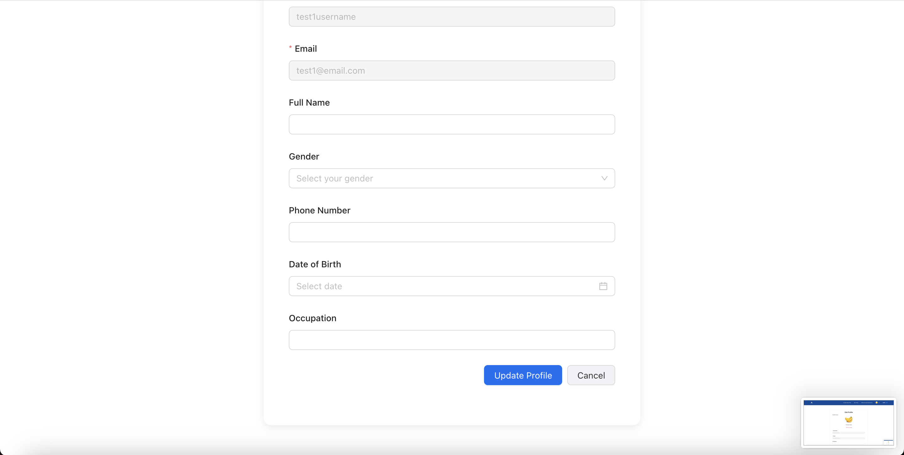

### Responsive Design

The application is built with a responsive design approach, ensuring an optimal viewing and interaction experience across a variety of devices and screen sizes. The layout dynamically adjusts to provide seamless usability, whether on desktop, tablet, or mobile.

- **Main Feed - Desktop to Tablet View (GIF):**
  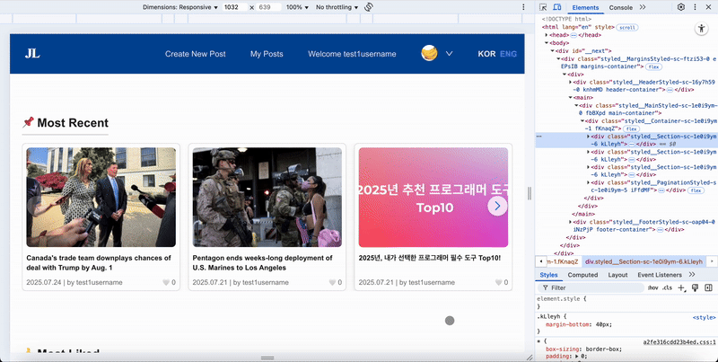

- **Individual Post View - Responsive Adjustment (GIF):**
  

- **Main Feed - Layout Re-arrangement (GIF):**
  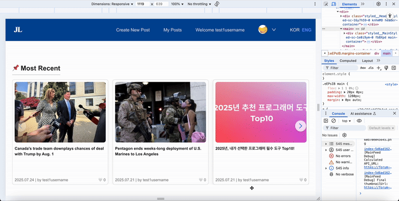

---

## Project Structure

```sh
└── /
    ├── README.md
    ├── amplify
    │   ├── #current-cloud-backend
    │   ├── .config
    │   ├── README.md
    │   ├── backend
    │   ├── cli.json
    │   ├── hooks
    │   └── team-provider-info.json
    ├── declaration.d.ts
    ├── eslint.config.mjs
    ├── next-env.d.ts
    ├── next.config.mjs
    ├── node_modules
    │   ├── .bin
    │   ├── .package-lock.json
    │   ├── @ampproject
    │   ├── @ant-design
    │   ├── @babel
    │   ├── @emotion
    │   ├── @eslint
    │   ├── @eslint-community
    │   ├── @humanfs
    │   ├── @humanwhocodes
    │   ├── @jridgewell
    │   ├── @next
    │   ├── @nodelib
    │   ├── @nolyfill
    │   ├── @rc-component
    │   ├── @reduxjs
    │   ├── @remirror
    │   ├── @rtsao
    │   ├── @rushstack
    │   ├── @standard-schema
    │   ├── @swc
    │   ├── @tiptap
    │   ├── @toast-ui
    │   ├── @types
    │   ├── @typescript-eslint
    │   ├── @ungap
    │   ├── @unrs
    │   ├── acorn
    │   ├── acorn-jsx
    │   ├── ajv
    │   ├── ansi-styles
    │   ├── antd
    │   ├── argparse
    │   ├── aria-query
    │   ├── array-buffer-byte-length
    │   ├── array-includes
    │   ├── array.prototype.findlast
    │   ├── array.prototype.findlastindex
    │   ├── array.prototype.flat
    │   ├── array.prototype.flatmap
    │   ├── array.prototype.tosorted
    │   ├── arraybuffer.prototype.slice
    │   ├── ast-types-flow
    │   ├── async-function
    │   ├── asynckit
    │   ├── available-typed-arrays
    │   ├── axe-core
    │   ├── axios
    │   ├── axobject-query
    │   ├── babel-plugin-styled-components
    │   ├── bail
    │   ├── balanced-match
    │   ├── brace-expansion
    │   ├── braces
    │   ├── browserslist
    │   ├── busboy
    │   ├── call-bind
    │   ├── call-bind-apply-helpers
    │   ├── call-bound
    │   ├── callsites
    │   ├── camelize
    │   ├── caniuse-lite
    │   ├── ccount
    │   ├── chalk
    │   ├── character-entities
    │   ├── character-entities-html4
    │   ├── character-entities-legacy
    │   ├── character-reference-invalid
    │   ├── classnames
    │   ├── client-only
    │   ├── clsx
    │   ├── color-convert
    │   ├── color-name
    │   ├── combined-stream
    │   ├── comma-separated-tokens
    │   ├── compute-scroll-into-view
    │   ├── concat-map
    │   ├── convert-source-map
    │   ├── cookie
    │   ├── cookies-next
    │   ├── copy-to-clipboard
    │   ├── crelt
    │   ├── cross-fetch
    │   ├── cross-spawn
    │   ├── css-color-keywords
    │   ├── css-to-react-native
    │   ├── csstype
    │   ├── damerau-levenshtein
    │   ├── data-view-buffer
    │   ├── data-view-byte-length
    │   ├── data-view-byte-offset
    │   ├── dayjs
    │   ├── debug
    │   ├── decode-named-character-reference
    │   ├── deep-is
    │   ├── deepmerge
    │   ├── define-data-property
    │   ├── define-properties
    │   ├── delayed-stream
    │   ├── dequal
    │   ├── devlop
    │   ├── doctrine
    │   ├── dompurify
    │   ├── dotenv
    │   ├── dunder-proto
    │   ├── electron-to-chromium
    │   ├── emoji-regex
    │   ├── entities
    │   ├── es-abstract
    │   ├── es-define-property
    │   ├── es-errors
    │   ├── es-iterator-helpers
    │   ├── es-object-atoms
    │   ├── es-set-tostringtag
    │   ├── es-shim-unscopables
    │   ├── es-to-primitive
    │   ├── escalade
    │   ├── escape-string-regexp
    │   ├── eslint
    │   ├── eslint-config-next
    │   ├── eslint-import-resolver-node
    │   ├── eslint-import-resolver-typescript
    │   ├── eslint-module-utils
    │   ├── eslint-plugin-import
    │   ├── eslint-plugin-jsx-a11y
    │   ├── eslint-plugin-react
    │   ├── eslint-plugin-react-hooks
    │   ├── eslint-scope
    │   ├── eslint-visitor-keys
    │   ├── espree
    │   ├── esquery
    │   ├── esrecurse
    │   ├── estraverse
    │   ├── estree-util-is-identifier-name
    │   ├── esutils
    │   ├── eventemitter3
    │   ├── extend
    │   ├── fast-deep-equal
    │   ├── fast-glob
    │   ├── fast-json-stable-stringify
    │   ├── fast-levenshtein
    │   ├── fastq
    │   ├── file-entry-cache
    │   ├── fill-range
    │   ├── find-up
    │   ├── flat-cache
    │   ├── flatted
    │   ├── follow-redirects
    │   ├── for-each
    │   ├── form-data
    │   ├── formik
    │   ├── function-bind
    │   ├── function.prototype.name
    │   ├── functions-have-names
    │   ├── gensync
    │   ├── get-intrinsic
    │   ├── get-proto
    │   ├── get-symbol-description
    │   ├── get-tsconfig
    │   ├── glob-parent
    │   ├── glob-to-regexp
    │   ├── globals
    │   ├── globalthis
    │   ├── gopd
    │   ├── graceful-fs
    │   ├── graphemer
    │   ├── has-bigints
    │   ├── has-flag
    │   ├── has-property-descriptors
    │   ├── has-proto
    │   ├── has-symbols
    │   ├── has-tostringtag
    │   ├── hasown
    │   ├── hast-util-to-jsx-runtime
    │   ├── hast-util-whitespace
    │   ├── hoist-non-react-statics
    │   ├── html-parse-stringify
    │   ├── html-url-attributes
    │   ├── http-proxy
    │   ├── http-proxy-middleware
    │   ├── i18next
    │   ├── i18next-browser-languagedetector
    │   ├── i18next-http-backend
    │   ├── ignore
    │   ├── immer
    │   ├── import-fresh
    │   ├── imurmurhash
    │   ├── inline-style-parser
    │   ├── internal-slot
    │   ├── is-alphabetical
    │   ├── is-alphanumerical
    │   ├── is-array-buffer
    │   ├── is-async-function
    │   ├── is-bigint
    │   ├── is-boolean-object
    │   ├── is-bun-module
    │   ├── is-callable
    │   ├── is-core-module
    │   ├── is-data-view
    │   ├── is-date-object
    │   ├── is-decimal
    │   ├── is-extglob
    │   ├── is-finalizationregistry
    │   ├── is-generator-function
    │   ├── is-glob
    │   ├── is-hexadecimal
    │   ├── is-map
    │   ├── is-negative-zero
    │   ├── is-number
    │   ├── is-number-object
    │   ├── is-plain-obj
    │   ├── is-plain-object
    │   ├── is-regex
    │   ├── is-set
    │   ├── is-shared-array-buffer
    │   ├── is-string
    │   ├── is-symbol
    │   ├── is-typed-array
    │   ├── is-weakmap
    │   ├── is-weakref
    │   ├── is-weakset
    │   ├── isarray
    │   ├── isexe
    │   ├── iterator.prototype
    │   ├── js-tokens
    │   ├── js-yaml
    │   ├── jsesc
    │   ├── json-buffer
    │   ├── json-schema-traverse
    │   ├── json-stable-stringify-without-jsonify
    │   ├── json2mq
    │   ├── json5
    │   ├── jsx-ast-utils
    │   ├── keyv
    │   ├── language-subtag-registry
    │   ├── language-tags
    │   ├── levn
    │   ├── linkify-it
    │   ├── locate-path
    │   ├── lodash
    │   ├── lodash-es
    │   ├── lodash.merge
    │   ├── longest-streak
    │   ├── loose-envify
    │   ├── lru-cache
    │   ├── markdown-it
    │   ├── markdown-table
    │   ├── math-intrinsics
    │   ├── mdast-util-find-and-replace
    │   ├── mdast-util-from-markdown
    │   ├── mdast-util-gfm
    │   ├── mdast-util-gfm-autolink-literal
    │   ├── mdast-util-gfm-footnote
    │   ├── mdast-util-gfm-strikethrough
    │   ├── mdast-util-gfm-table
    │   ├── mdast-util-gfm-task-list-item
    │   ├── mdast-util-mdx-expression
    │   ├── mdast-util-mdx-jsx
    │   ├── mdast-util-mdxjs-esm
    │   ├── mdast-util-phrasing
    │   ├── mdast-util-to-hast
    │   ├── mdast-util-to-markdown
    │   ├── mdast-util-to-string
    │   ├── mdurl
    │   ├── merge2
    │   ├── micromark
    │   ├── micromark-core-commonmark
    │   ├── micromark-extension-gfm
    │   ├── micromark-extension-gfm-autolink-literal
    │   ├── micromark-extension-gfm-footnote
    │   ├── micromark-extension-gfm-strikethrough
    │   ├── micromark-extension-gfm-table
    │   ├── micromark-extension-gfm-tagfilter
    │   ├── micromark-extension-gfm-task-list-item
    │   ├── micromark-factory-destination
    │   ├── micromark-factory-label
    │   ├── micromark-factory-space
    │   ├── micromark-factory-title
    │   ├── micromark-factory-whitespace
    │   ├── micromark-util-character
    │   ├── micromark-util-chunked
    │   ├── micromark-util-classify-character
    │   ├── micromark-util-combine-extensions
    │   ├── micromark-util-decode-numeric-character-reference
    │   ├── micromark-util-decode-string
    │   ├── micromark-util-encode
    │   ├── micromark-util-html-tag-name
    │   ├── micromark-util-normalize-identifier
    │   ├── micromark-util-resolve-all
    │   ├── micromark-util-sanitize-uri
    │   ├── micromark-util-subtokenize
    │   ├── micromark-util-symbol
    │   ├── micromark-util-types
    │   ├── micromatch
    │   ├── mime-db
    │   ├── mime-types
    │   ├── minimatch
    │   ├── minimist
    │   ├── moment
    │   ├── ms
    │   ├── nanoid
    │   ├── napi-postinstall
    │   ├── natural-compare
    │   ├── next
    │   ├── next-cookies
    │   ├── node-fetch
    │   ├── node-releases
    │   ├── object-assign
    │   ├── object-inspect
    │   ├── object-keys
    │   ├── object.assign
    │   ├── object.entries
    │   ├── object.fromentries
    │   ├── object.groupby
    │   ├── object.values
    │   ├── optionator
    │   ├── orderedmap
    │   ├── own-keys
    │   ├── p-limit
    │   ├── p-locate
    │   ├── parent-module
    │   ├── parse-entities
    │   ├── path-exists
    │   ├── path-key
    │   ├── path-parse
    │   ├── picocolors
    │   ├── picomatch
    │   ├── possible-typed-array-names
    │   ├── postcss
    │   ├── postcss-value-parser
    │   ├── prelude-ls
    │   ├── prop-types
    │   ├── property-expr
    │   ├── property-information
    │   ├── prosemirror-changeset
    │   ├── prosemirror-collab
    │   ├── prosemirror-commands
    │   ├── prosemirror-dropcursor
    │   ├── prosemirror-gapcursor
    │   ├── prosemirror-history
    │   ├── prosemirror-inputrules
    │   ├── prosemirror-keymap
    │   ├── prosemirror-markdown
    │   ├── prosemirror-menu
    │   ├── prosemirror-model
    │   ├── prosemirror-schema-basic
    │   ├── prosemirror-schema-list
    │   ├── prosemirror-state
    │   ├── prosemirror-tables
    │   ├── prosemirror-trailing-node
    │   ├── prosemirror-transform
    │   ├── prosemirror-view
    │   ├── proxy-from-env
    │   ├── punycode
    │   ├── punycode.js
    │   ├── queue-microtask
    │   ├── rc-cascader
    │   ├── rc-checkbox
    │   ├── rc-collapse
    │   ├── rc-dialog
    │   ├── rc-drawer
    │   ├── rc-dropdown
    │   ├── rc-field-form
    │   ├── rc-image
    │   ├── rc-input
    │   ├── rc-input-number
    │   ├── rc-mentions
    │   ├── rc-menu
    │   ├── rc-motion
    │   ├── rc-notification
    │   ├── rc-overflow
    │   ├── rc-pagination
    │   ├── rc-picker
    │   ├── rc-progress
    │   ├── rc-rate
    │   ├── rc-resize-observer
    │   ├── rc-segmented
    │   ├── rc-select
    │   ├── rc-slider
    │   ├── rc-steps
    │   ├── rc-switch
    │   ├── rc-table
    │   ├── rc-tabs
    │   ├── rc-textarea
    │   ├── rc-tooltip
    │   ├── rc-tree
    │   ├── rc-tree-select
    │   ├── rc-upload
    │   ├── rc-util
    │   ├── rc-virtual-list
    │   ├── react
    │   ├── react-dom
    │   ├── react-fast-compare
    │   ├── react-i18next
    │   ├── react-is
    │   ├── react-markdown
    │   ├── react-redux
    │   ├── redux
    │   ├── redux-persist
    │   ├── redux-thunk
    │   ├── reflect.getprototypeof
    │   ├── regexp.prototype.flags
    │   ├── remark-gfm
    │   ├── remark-parse
    │   ├── remark-rehype
    │   ├── remark-stringify
    │   ├── requires-port
    │   ├── reselect
    │   ├── resize-observer-polyfill
    │   ├── resolve
    │   ├── resolve-from
    │   ├── resolve-pkg-maps
    │   ├── reusify
    │   ├── rope-sequence
    │   ├── run-parallel
    │   ├── safe-array-concat
    │   ├── safe-push-apply
    │   ├── safe-regex-test
    │   ├── scheduler
    │   ├── scroll-into-view-if-needed
    │   ├── semver
    │   ├── set-function-length
    │   ├── set-function-name
    │   ├── set-proto
    │   ├── shallowequal
    │   ├── shebang-command
    │   ├── shebang-regex
    │   ├── side-channel
    │   ├── side-channel-list
    │   ├── side-channel-map
    │   ├── side-channel-weakmap
    │   ├── source-map-js
    │   ├── space-separated-tokens
    │   ├── stable-hash
    │   ├── stop-iteration-iterator
    │   ├── streamsearch
    │   ├── string-convert
    │   ├── string.prototype.includes
    │   ├── string.prototype.matchall
    │   ├── string.prototype.repeat
    │   ├── string.prototype.trim
    │   ├── string.prototype.trimend
    │   ├── string.prototype.trimstart
    │   ├── stringify-entities
    │   ├── strip-bom
    │   ├── strip-json-comments
    │   ├── style-to-js
    │   ├── style-to-object
    │   ├── styled-components
    │   ├── styled-jsx
    │   ├── stylis
    │   ├── supports-color
    │   ├── supports-preserve-symlinks-flag
    │   ├── swiper
    │   ├── throttle-debounce
    │   ├── tiny-case
    │   ├── tiny-warning
    │   ├── tinyglobby
    │   ├── to-regex-range
    │   ├── toggle-selection
    │   ├── toposort
    │   ├── tr46
    │   ├── trim-lines
    │   ├── trough
    │   ├── ts-api-utils
    │   ├── tsconfig-paths
    │   ├── tslib
    │   ├── tui-color-picker
    │   ├── type-check
    │   ├── type-fest
    │   ├── typed-array-buffer
    │   ├── typed-array-byte-length
    │   ├── typed-array-byte-offset
    │   ├── typed-array-length
    │   ├── typescript
    │   ├── uc.micro
    │   ├── unbox-primitive
    │   ├── undici-types
    │   ├── unified
    │   ├── unist-util-is
    │   ├── unist-util-position
    │   ├── unist-util-stringify-position
    │   ├── unist-util-visit
    │   ├── unist-util-visit-parents
    │   ├── universal-cookie
    │   ├── unrs-resolver
    │   ├── update-browserslist-db
    │   ├── uri-js
    │   ├── use-sync-external-store
    │   ├── vfile
    │   ├── vfile-message
    │   ├── void-elements
    │   ├── w3c-keyname
    │   ├── watchpack
    │   ├── webidl-conversions
    │   ├── whatwg-url
    │   ├── which
    │   ├── which-boxed-primitive
    │   ├── which-builtin-type
    │   ├── which-collection
    │   ├── which-typed-array
    │   ├── word-wrap
    │   ├── yallist
    │   ├── yocto-queue
    │   ├── yup
    │   └── zwitch
    ├── package-lock.json
    ├── package.json
    ├── postman.txt
    ├── public
    │   ├── favicon.ico
    │   ├── favicon1.ico
    │   ├── file.svg
    │   ├── forum_logo.png
    │   ├── globe.svg
    │   ├── google-logo.svg
    │   ├── kakao-logo.svg
    │   ├── locales
    │   ├── naver-logo.png
    │   ├── next.svg
    │   ├── no-image.jpg
    │   ├── vercel.svg
    │   └── window.svg
    ├── src
    │   ├── amplifyconfiguration.json
    │   ├── assets
    │   ├── aws-exports.js
    │   ├── components
    │   ├── config
    │   ├── features
    │   ├── i18n.ts
    │   ├── pages
    │   ├── redux
    │   ├── styles
    │   └── utils
    └── tsconfig.json
```

### Project Index

<details open>
    <summary><b><code>/</code></b></summary>
    <details>
        <summary><b>__root__</b></summary>
        <blockquote>
            <div class='directory-path' style='padding: 8px 0; color: #666;'>
                <code><b>⦿ __root__</b></code>
            <table style='width: 100%; border-collapse: collapse;'>
            <thead>
                <tr style='background-color: #f8f9fa;'>
                    <th style='width: 30%; text-align: left; padding: 8px;'>File Name</th>
                    <th style='text-align: left; padding: 8px;'>Summary</th>
                </tr>
            </thead>
                <tr style='border-bottom: 1px solid #eee;'>
                    <td style='padding: 8px;'><b><a href='/next.config.mjs'>next.config.mjs</a></b></td>
                    <td style='padding: 8px;'>- The <code>next.config.mjs</code> file configures the Next.js application<br>- It enables React Strict Mode and SWC minification for performance optimization<br>- Importantly, it manages environment variables, making <code>NEXT_PUBLIC_API_URL</code> available client-side, and provisions for routing API requests (currently commented out) to a backend URL defined by <code>NEXT_PUBLIC_BACKEND_URL</code><br>- This setup facilitates a streamlined development and deployment process.</td>
                </tr>
                <tr style='border-bottom: 1px solid #eee;'>
                    <td style='padding: 8px;'><b><a href='/declaration.d.ts'>declaration.d.ts</a></b></td>
                    <td style='padding: 8px;'>- The <code>declaration.d.ts</code> file facilitates the use of the <code>@toast-ui/editor</code> library within the project<br>- It acts as a type definition, enabling TypeScripts type checking and autocompletion features for the editor librarys API<br>- This ensures type safety and improves developer experience when integrating the rich text editor into the application<br>- The file contributes to a robust and maintainable codebase by providing type information for external dependencies.</td>
                </tr>
                <tr style='border-bottom: 1px solid #eee;'>
                    <td style='padding: 8px;'><b><a href='/next-env.d.ts'>next-env.d.ts</a></b></td>
                    <td style='padding: 8px;'>This file is automatically generated by Next.js and ensures that **TypeScript recognizes Next.js-specific types** ⚛️. It provides type definitions for environment variables and other Next.js global types, essential for proper type checking throughout the project.</td>
                </tr>
                <tr style='border-bottom: 1px solid #eee;'>
                    <td style='padding: 8px;'><b><a href='/package-lock.json'>package-lock.json</a></b></td>
                    <td style='padding: 8px;'>This file is automatically generated by `npm` and records the **exact version and dependency tree** 🌳 of all installed packages. It ensures consistent builds across different environments by locking down the versions of direct and transitive dependencies.</td>
                </tr>
                <tr style='border-bottom: 1px solid #eee;'>
                    <td style='padding: 8px;'><b><a href='/package.json'>package.json</a></b></td>
                    <td style='padding: 8px;'>This file defines the **project's metadata, scripts, and dependencies** 📦. It includes information like the project name, version, and lists all required packages (dependencies) and development-only packages (devDependencies), as well as runnable scripts (e.g., `start`, `dev`, `build`).</td>
                </tr>
                <tr style='border-bottom: 1px solid #eee;'>
                    <td style='padding: 8px;'><b><a href='/tsconfig.json'>tsconfig.json</a></b></td>
                    <td style='padding: 8px;'>This file contains the **TypeScript compiler configuration** ⚙️ for the project. It defines how TypeScript files are compiled, including options for target ECMAScript version, module resolution, JSX support, and strictness rules, ensuring proper type checking and compilation for the Next.js application.</td>
                </tr>
                <tr style='border-bottom: 1px solid #eee;'>
                    <td style='padding: 8px;'><b><a href='/eslint.config.mjs'>eslint.config.mjs</a></b></td>
                    <td style='padding: 8px;'>This file configures **ESLint for code linting** 🧹. It defines rules for code style, potential errors, and best practices, helping to maintain code quality and consistency across the frontend project. Being an `.mjs` file, it signifies an ES module configuration.</td>
                </tr>
                <tr style='border-bottom: 1px solid #eee;'>
                    <td style='padding: 8px;'><b><a href='/postman.txt'>postman.txt</a></b></td>
                    <td style='padding: 8px;'>This file likely contains **Postman collection IDs or API endpoint details** 🔗. While typically associated with backend API testing, it might store references to collections used for frontend development to interact with the backend API, facilitating testing and development workflows.</td>
                </tr>
            </table>
        </blockquote>
    </details>
	<!-- amplify Submodule -->
	<details>
        <summary><b>amplify</b></summary>
        <blockquote>
            <div class='directory-path' style='padding: 8px 0; color: #666;'>
                <code><b>⦿ amplify</b></code>
            <table style='width: 100%; border-collapse: collapse;'>
            <thead>
                <tr style='background-color: #f8f9fa;'>
                    <th style='width: 30%; text-align: left; padding: 8px;'>File Name</th>
                    <th style='text-align: left; padding: 8px;'>Summary</th>
                </tr>
            </thead>
                <tr style='border-bottom: 1px solid #eee;'>
                    <td style='padding: 8px;'><b><a href='/amplify/cli.json'>cli.json</a></b></td>
                    <td style='padding: 8px;'>This file stores **configuration details for the AWS Amplify CLI** 🛠️ specific to this project. It includes settings such as the default editor, environment names, and other CLI-related preferences, guiding how the Amplify CLI interacts with your project setup.</td>
                </tr>
                <tr style='border-bottom: 1px solid #eee;'>
                    <td style='padding: 8px;'><b><a href='/amplify/team-provider-info.json'>team-provider-info.json</a></b></td>
                    <td style='padding: 8px;'>This file contains **environment-specific AWS resource information** ☁️ for the Amplify project. It's generated and updated by the Amplify CLI and holds details about the AWS regions, IAM roles, and cloud formation stack names for each deployed environment (e.g., `dev`, `prod`), enabling team members to work on the same backend.</td>
                </tr>
            </table>
			<!-- .config Submodule -->
			<details>
                <summary><b>.config</b></summary>
                <blockquote>
                    <div class='directory-path' style='padding: 8px 0; color: #666;'>
                        <code><b>⦿ amplify/.config</b></code>
                    <table style='width: 100%; border-collapse: collapse;'>
                    <thead>
                        <tr style='background-color: #f8f9fa;'>
                            <th style='width: 30%; text-align: left; padding: 8px;'>File Name</th>
                            <th style='text-align: left; padding: 8px;'>Summary</th>
                        </tr>
                    </thead>
                        <tr style='border-bottom: 1px solid #eee;'>
                            <td style='padding: 8px;'><b><a href='/amplify/.config/project-config.json'>project-config.json</a></b></td>
                            <td style='padding: 8px;'>This file stores **Amplify project-level configurations** ⚙️, including details about the frontend framework used, JavaScript configurations, and specifies the providers (e.g., `awscloudformation`) for your Amplify backend, ensuring the CLI configures resources correctly.</td>
                        </tr>
                        <tr style='border-bottom: 1px solid #eee;'>
                            <td style='padding: 8px;'><b><a href='/amplify/.config/local-aws-info.json'>local-aws-info.json</a></b></td>
                            <td style='padding: 8px;'>This file holds **local AWS account information** 🔑 and user credentials (e.g., AWS profile name) used by the Amplify CLI for interacting with AWS services in your local development environment. It links your local setup to your AWS account.</td>
                        </tr>
                        <tr style='border-bottom: 1px solid #eee;'>
                            <td style='padding: 8px;'><b><a href='/amplify/.config/local-env-info.json'>local-env-info.json</a></b></td>
                            <td style='padding: 8px;'>This file contains **local environment-specific details** 🏠 for your Amplify project, such as the current Amplify environment name (`dev`, `staging`, `etc.`), whether a sandbox is active, and the last used AWS profile. It helps the CLI manage local and cloud environment states.</td>
                        </tr>
                    </table>
                </blockquote>
            </details>
			<!-- #current-cloud-backend Submodule -->
			<details>
                <summary><b>#current-cloud-backend</b></summary>
                <blockquote>
                    <div class='directory-path' style='padding: 8px 0; color: #666;'>
                        <code><b>⦿ amplify/#current-cloud-backend</b></code>
                    <table style='width: 100%; border-collapse: collapse;'>
                    <thead>
                        <tr style='background-color: #f8f9fa;'>
                            <th style='width: 30%; text-align: left; padding: 8px;'>File Name</th>
                            <th style='text-align: left; padding: 8px;'>Summary</th>
                        </tr>
                    </thead>
                        <tr style='border-bottom: 1px solid #eee;'>
                            <td style='padding: 8px;'><b><a href='/amplify/#current-cloud-backend/backend-config.json'>backend-config.json</a></b></td>
                            <td style='padding: 8px;'>This file defines the **configuration of your Amplify backend categories** 🏗️ (e.g., authentication, API, storage, functions). It outlines the services provisioned for your project and their high-level settings, reflecting the structure of your cloud backend.</td>
                        </tr>
                        <tr style='border-bottom: 1px solid #eee;'>
                            <td style='padding: 8px;'><b><a href='/amplify/#current-cloud-backend/tags.json'>tags.json</a></b></td>
                            <td style='padding: 8px;'>This file contains **AWS resource tags** 🏷️ associated with your Amplify project. Tags are key-value pairs that help you manage, identify, organize, search for, and filter resources, and can be used for cost allocation and access control.</td>
                        </tr>
                        <tr style='border-bottom: 1px solid #eee;'>
                            <td style='padding: 8px;'><b><a href='/amplify/#current-cloud-backend/amplify-meta.json'>amplify-meta.json</a></b></td>
                            <td style='padding: 8px;'>This file holds **metadata about your deployed Amplify resources** 📊. It's a comprehensive record of all backend categories (e.g., Auth, API, Hosting) provisioned in the cloud, including their CloudFormation stack names, service configurations, and resource identifiers like ARN/region.</td>
                        </tr>
                    </table>
                </blockquote>
            </details>
			<!-- backend Submodule -->
		<details>
                <summary><b>backend</b></summary>
                <blockquote>
                    <div class='directory-path' style='padding: 8px 0; color: #666;'>
                        <code><b>⦿ amplify/backend</b></code>
                    <table style='width: 100%; border-collapse: collapse;'>
                    <thead>
                        <tr style='background-color: #f8f9fa;'>
                            <th style='width: 30%; text-align: left; padding: 8px;'>File Name</th>
                            <th style='text-align: left; padding: 8px;'>Summary</th>
                        </tr>
                    </thead>
                        <tr style='border-bottom: 1px solid #eee;'>
                            <td style='padding: 8px;'><b><a href='/amplify/backend/backend-config.json'>backend-config.json</a></b></td>
                            <td style='padding: 8px;'>This file defines the **configuration of your Amplify backend categories** 🏗️ (e.g., authentication, API, storage, functions). It outlines the services provisioned for your project and their high-level settings, reflecting the structure of your cloud backend.</td>
                        </tr>
                        <tr style='border-bottom: 1px solid #eee;'>
                            <td style='padding: 8px;'><b><a href='/amplify/backend/tags.json'>tags.json</a></b></td>
                            <td style='padding: 8px;'>This file contains **AWS resource tags** 🏷️ associated with your Amplify project. Tags are key-value pairs that help you manage, identify, organize, search for, and filter resources, and can be used for cost allocation and access control.</td>
                        </tr>
                        <tr style='border-bottom: 1px solid #eee;'>
                            <td style='padding: 8px;'><b><a href='/amplify/backend/amplify-meta.json'>amplify-meta.json</a></b></td>
                            <td style='padding: 8px;'>This file holds **metadata about your deployed Amplify resources** 📊. It's a comprehensive record of all backend categories (e.g., Auth, API, Hosting) provisioned in the cloud, including their CloudFormation stack names, service configurations, and resource identifiers like ARN/region.</td>
                        </tr>
                    </table>
					<!-- types Submodule -->
					<details>
                        <summary><b>types</b></summary>
                        <blockquote>
                            <div class='directory-path' style='padding: 8px 0; color: #666;'>
                                <code><b>⦿ amplify.backend.types</b></code>
                            <table style='width: 100%; border-collapse: collapse;'>
                            <thead>
                                <tr style='background-color: #f8f9fa;'>
                                    <th style='width: 30%; text-align: left; padding: 8px;'>File Name</th>
                                    <th style='text-align: left; padding: 8px;'>Summary</th>
                                </tr>
                            </thead>
                                <tr style='border-bottom: 1px solid #eee;'>
                                    <td style='padding: 8px;'><b><a href='/amplify/backend/types/amplify-dependent-resources-ref.d.ts'>amplify-dependent-resources-ref.d.ts</a></b></td>
                                    <td style='padding: 8px;'>This **TypeScript declaration file** (`.d.ts`) is generated by AWS Amplify ⚙️. It provides type definitions for the resources deployed via Amplify (e.g., authentication, API endpoints), allowing your frontend code to interact with these backend services in a type-safe manner and enabling auto-completion.</td>
                                </tr>
                            </table>
                        </blockquote>
                    </details>
                </blockquote>
            </details>
			<!-- hooks Submodule -->
			<details>
                <summary><b>hooks</b></summary>
                <blockquote>
                    <div class='directory-path' style='padding: 8px 0; color: #666;'>
                        <code><b>⦿ amplify.hooks</b></code>
                    <table style='width: 100%; border-collapse: collapse;'>
                    <thead>
                        <tr style='background-color: #f8f9fa;'>
                            <th style='width: 30%; text-align: left; padding: 8px;'>File Name</th>
                            <th style='text-align: left; padding: 8px;'>Summary</th>
                        </tr>
                    </thead>
                        <tr style='border-bottom: 1px solid #eee;'>
                            <td style='padding: 8px;'><b><a href='/amplify/hooks/post-push.sh.sample'>post-push.sh.sample</a></b></td>
                            <td style='padding: 8px;'>This is a **sample shell script** 🐚 designed to be executed by the Amplify CLI *after* an `amplify push` operation. Developers can customize this hook to run automated tasks like updating environment variables, deploying to a specific hosting, or triggering other CI/CD pipelines once the cloud resources are updated.</td>
                        </tr>
                        <tr style='border-bottom: 1px solid #eee;'>
                            <td style='padding: 8px;'><b><a href='/amplify/hooks/pre-push.js.sample'>pre-push.js.sample</a></b></td>
                            <td style='padding: 8px;'>This is a **sample JavaScript script** 📜 designed to be executed by the Amplify CLI *before* an `amplify push` operation. It allows developers to perform checks, validations, or other preparatory steps (e.g., linting, testing, code generation) to ensure the project is ready for deployment to the cloud.</td>
                        </tr>
                    </table>
                </blockquote>
            </details>
        </blockquote>
    </details>
	<!-- public Submodule -->
	<details>
        <summary><b>public</b></summary>
        <blockquote>
            <div class='directory-path' style='padding: 8px 0; color: #666;'>
                <code><b>⦿ public</b></code>
            <details>
                <summary><b>locales</b></summary>
                <blockquote>
                    <div class='directory-path' style='padding: 8px 0; color: #666;'>
                        <code><b>⦿ public.locales</b></code>
                    <details>
                        <summary><b>ko</b></summary>
                        <blockquote>
                            <div class='directory-path' style='padding: 8px 0; color: #666;'>
                                <code><b>⦿ public.locales.ko</b></code>
                            <table style='width: 100%; border-collapse: collapse;'>
                            <thead>
                                <tr style='background-color: #f8f9fa;'>
                                    <th style='width: 30%; text-align: left; padding: 8px;'>File Name</th>
                                    <th style='text-align: left; padding: 8px;'>Summary</th>
                                </tr>
                            </thead>
                                <tr style='border-bottom: 1px solid #eee;'>
                                    <td style='padding: 8px;'><b><a href='/public/locales/ko/common.json'>common.json</a></b></td>
                                    <td style='padding: 8px;'>Contains **common UI translation strings** 💬 for the Korean language, used across various parts of the application such as generic buttons, error messages, and shared labels.</td>
                                </tr>
                                <tr style='border-bottom: 1px solid #eee;'>
                                    <td style='padding: 8px;'><b><a href='/public/locales/ko/mainfeed.json'>mainfeed.json</a></b></td>
                                    <td style='padding: 8px;'>Provides **Korean translation keys and values** 📝 specific to the main forum feed page, including text for post listings, category filters, and feed navigation elements.</td>
                                </tr>
                                <tr style='border-bottom: 1px solid #eee;'>
                                    <td style='padding: 8px;'><b><a href='/public/locales/ko/editpost.json'>editpost.json</a></b></td>
                                    <td style='padding: 8px;'>Holds **Korean translation strings** ✏️ for the "Edit Post" functionality, covering form fields, action buttons, and validation messages for modifying existing forum posts.</td>
                                </tr>
                                <tr style='border-bottom: 1px solid #eee;'>
                                    <td style='padding: 8px;'><b><a href='/public/locales/ko/home.json'>home.json</a></b></td>
                                    <td style='padding: 8px;'>Contains **Korean translation content** 🏠 for the homepage of the application, including welcome messages, introductory texts, and any specific elements displayed on the landing page.</td>
                                </tr>
                                <tr style='border-bottom: 1px solid #eee;'>
                                    <td style='padding: 8px;'><b><a href='/public/locales/ko/createpost.json'>createpost.json</a></b></td>
                                    <td style='padding: 8px;'>Provides **Korean translation keys** ✨ for the "Create Post" interface, encompassing text for new post forms, image upload prompts, and submission controls.</td>
                                </tr>
                                <tr style='border-bottom: 1px solid #eee;'>
                                    <td style='padding: 8px;'><b><a href='/public/locales/ko/detailfeed.json'>detailfeed.json</a></b></td>
                                    <td style='padding: 8px;'>Holds **Korean translation strings** 📖 for the detailed post view, including text for comments, post content, author information, and related interactions on a single post's page.</td>
                                </tr>
                            </table>
                            <details>
                                <summary><b>Margins</b></summary>
                                <blockquote>
                                    <div class='directory-path' style='padding: 8px 0; color: #666;'>
                                        <code><b>⦿ public.locales.ko.Margins</b></code>
                                    <table style='width: 100%; border-collapse: collapse;'>
                                    <thead>
                                        <tr style='background-color: #f8f9fa;'>
                                            <th style='width: 30%; text-align: left; padding: 8px;'>File Name</th>
                                            <th style='text-align: left; padding: 8px;'>Summary</th>
                                        </tr>
                                    </thead>
                                        <tr style='border-bottom: 1px solid #eee;'>
                                            <td style='padding: 8px;'><b><a href='/public/locales/ko/Margins/header.json'>header.json</a></b></td>
                                            <td style='padding: 8px;'>Contains **Korean translation keys** ⬆️ for text content displayed within the header component, ensuring elements like navigation links, titles, and user icons are correctly localized.</td>
                                        </tr>
                                        <tr style='border-bottom: 1px solid #eee;'>
                                            <td style='padding: 8px;'><b><a href='/public/locales/ko/Margins/footer.json'>footer.json</a></b></td>
                                            <td style='padding: 8px;'>Provides **Korean translation keys** ⬇️ for text content found in the footer component, such as copyright notices, contact information, or other bottom-page links.</td>
                                        </tr>
                                    </table>
                                </blockquote>
                            </details>
							<!-- ClientServices Submodule -->
						<details>
                                <summary><b>ClientServices</b></summary>
                                <blockquote>
                                    <div class='directory-path' style='padding: 8px 0; color: #666;'>
                                        <code><b>⦿ public.locales.ko.ClientServices</b></code>
                                    <table style='width: 100%; border-collapse: collapse;'>
                                    <thead>
                                        <tr style='background-color: #f8f9fa;'>
                                            <th style='width: 30%; text-align: left; padding: 8px;'>File Name</th>
                                            <th style='text-align: left; padding: 8px;'>Summary</th>
                                        </tr>
                                    </thead>
                                        <tr style='border-bottom: 1px solid #eee;'>
                                            <td style='padding: 8px;'><b><a href='/public/locales/ko/ClientServices/profileupdate.json'>profileupdate.json</a></b></td>
                                            <td style='padding: 8px;'>Contains **Korean translation strings** 👤 for the user profile update page, including form fields, success/error messages, and confirmation prompts for modifying user details.</td>
                                        </tr>
                                        <tr style='border-bottom: 1px solid #eee;'>
                                            <td style='padding: 8px;'><b><a href='/public/locales/ko/ClientServices/signup.json'>signup.json</a></b></td>
                                            <td style='padding: 8px;'>Provides **Korean translation keys** ✍️ for the user registration (sign-up) flow, covering fields like username, email, password, and related validation or success messages.</td>
                                        </tr>
                                        <tr style='border-bottom: 1px solid #eee;'>
                                            <td style='padding: 8px;'><b><a href='/public/locales/ko/ClientServices/forgotusername.json'>forgotusername.json</a></b></td>
                                            <td style='padding: 8px;'>Holds **Korean translation strings** 🤔 for the "Forgot Username" recovery process, including prompts for email input, instructional messages, and confirmation texts.</td>
                                        </tr>
                                        <tr style='border-bottom: 1px solid #eee;'>
                                            <td style='padding: 8px;'><b><a href='/public/locales/ko/ClientServices/login.json'>login.json</a></b></td>
                                            <td style='padding: 8px;'>Contains **Korean translation keys** 🚪 for the user login interface, covering fields for credentials, login buttons, and messages related to successful or failed login attempts.</td>
                                        </tr>
                                        <tr style='border-bottom: 1px solid #eee;'>
                                            <td style='padding: 8px;'><b><a href='/public/locales/ko/ClientServices/resetpassword.json'>resetpassword.json</a></b></td>
                                            <td style='padding: 8px;'>Provides **Korean translation strings** 🔒 for the "Reset Password" functionality, including fields for new passwords, confirmation, and status messages during the password reset process.</td>
                                        </tr>
                                        <tr style='border-bottom: 1px solid #eee;'>
                                            <td style='padding: 8px;'><b><a href='/public/locales/ko/ClientServices/forgotpassword.json'>forgotpassword.json</a></b></td>
                                            <td style='padding: 8px;'>Holds **Korean translation keys** ❓ for the "Forgot Password" recovery flow, covering prompts for email, instructions for password reset, and confirmation messages.</td>
                                        </tr>
                                        <tr style='border-bottom: 1px solid #eee;'>
                                            <td style='padding: 8px;'><b><a href='/public/locales/ko/ClientServices/profile.json'>profile.json</a></b></td>
                                            <td style='padding: 8px;'>Contains **Korean translation strings** 📊 for the user profile viewing page, encompassing display text for user information, statistics, and navigation within the profile section.</td>
                                        </tr>
                                    </table>
                                </blockquote>
                            </details>
                        </blockquote>
                    </details>
					<!-- en Submodule -->
<details>
                        <summary><b>en</b></summary>
                        <blockquote>
                            <div class='directory-path' style='padding: 8px 0; color: #666;'>
                                <code><b>⦿ public.locales.en</b></code>
                            <table style='width: 100%; border-collapse: collapse;'>
                            <thead>
                                <tr style='background-color: #f8f9fa;'>
                                    <th style='width: 30%; text-align: left; padding: 8px;'>File Name</th>
                                    <th style='text-align: left; padding: 8px;'>Summary</th>
                                </tr>
                            </thead>
                                <tr style='border-bottom: 1px solid #eee;'>
                                    <td style='padding: 8px;'><b><a href='/public/locales/en/common.json'>common.json</a></b></td>
                                    <td style='padding: 8px;'>Contains **common UI translation strings** 💬 for the English language, used across various parts of the application such as generic buttons, error messages, and shared labels.</td>
                                </tr>
                                <tr style='border-bottom: 1px solid #eee;'>
                                    <td style='padding: 8px;'><b><a href='/public/locales/en/mainfeed.json'>mainfeed.json</a></b></td>
                                    <td style='padding: 8px;'>Provides **English translation keys and values** 📝 specific to the main forum feed page, including text for post listings, category filters, and feed navigation elements.</td>
                                </tr>
                                <tr style='border-bottom: 1px solid #eee;'>
                                    <td style='padding: 8px;'><b><a href='/public/locales/en/editpost.json'>editpost.json</a></b></td>
                                    <td style='padding: 8px;'>Holds **English translation strings** ✏️ for the "Edit Post" functionality, covering form fields, action buttons, and validation messages for modifying existing forum posts.</td>
                                </tr>
                                <tr style='border-bottom: 1px solid #eee;'>
                                    <td style='padding: 8px;'><b><a href='/public/locales/en/home.json'>home.json</a></b></td>
                                    <td style='padding: 8px;'>Contains **English translation content** 🏠 for the homepage of the application, including welcome messages, introductory texts, and any specific elements displayed on the landing page.</td>
                                </tr>
                                <tr style='border-bottom: 1px solid #eee;'>
                                    <td style='padding: 8px;'><b><a href='/public/locales/en/createpost.json'>createpost.json</a></b></td>
                                    <td style='padding: 8px;'>Provides **English translation keys** ✨ for the "Create Post" interface, encompassing text for new post forms, image upload prompts, and submission controls.</td>
                                </tr>
                                <tr style='border-bottom: 1px solid #eee;'>
                                    <td style='padding: 8px;'><b><a href='/public/locales/en/detailfeed.json'>detailfeed.json</a></b></td>
                                    <td style='padding: 8px;'>Holds **English translation strings** 📖 for the detailed post view, including text for comments, post content, author information, and related interactions on a single post's page.</td>
                                </tr>
                            </table>
                            <details>
                                <summary><b>Margins</b></summary>
                                <blockquote>
                                    <div class='directory-path' style='padding: 8px 0; color: #666;'>
                                        <code><b>⦿ public.locales.en.Margins</b></code>
                                    <table style='width: 100%; border-collapse: collapse;'>
                                    <thead>
                                        <tr style='background-color: #f8f9fa;'>
                                            <th style='width: 30%; text-align: left; padding: 8px;'>File Name</th>
                                            <th style='text-align: left; padding: 8px;'>Summary</th>
                                        </tr>
                                    </thead>
                                        <tr style='border-bottom: 1px solid #eee;'>
                                            <td style='padding: 8px;'><b><a href='/public/locales/en/Margins/header.json'>header.json</a></b></td>
                                            <td style='padding: 8px;'>Contains **English translation keys** ⬆️ for text content displayed within the header component, ensuring elements like navigation links, titles, and user icons are correctly localized.</td>
                                        </tr>
                                        <tr style='border-bottom: 1px solid #eee;'>
                                            <td style='padding: 8px;'><b><a href='/public/locales/en/Margins/footer.json'>footer.json</a></b></td>
                                            <td style='padding: 8px;'>Provides **English translation keys** ⬇️ for text content found in the footer component, such as copyright notices, contact information, or other bottom-page links.</td>
                                        </tr>
                                    </table>
                                </blockquote>
                            </details>
                            <details>
                                <summary><b>ClientServices</b></summary>
                                <blockquote>
                                    <div class='directory-path' style='padding: 8px 0; color: #666;'>
                                        <code><b>⦿ public.locales.en.ClientServices</b></code>
                                    <table style='width: 100%; border-collapse: collapse;'>
                                    <thead>
                                        <tr style='background-color: #f8f9fa;'>
                                            <th style='width: 30%; text-align: left; padding: 8px;'>File Name</th>
                                            <th style='text-align: left; padding: 8px;'>Summary</th>
                                        </tr>
                                    </thead>
                                        <tr style='border-bottom: 1px solid #eee;'>
                                            <td style='padding: 8px;'><b><a href='/public/locales/en/ClientServices/profileupdate.json'>profileupdate.json</a></b></td>
                                            <td style='padding: 8px;'>Contains **English translation strings** 👤 for the user profile update page, including form fields, success/error messages, and confirmation prompts for modifying user details.</td>
                                        </tr>
                                        <tr style='border-bottom: 1px solid #eee;'>
                                            <td style='padding: 8px;'><b><a href='/public/locales/en/ClientServices/signup.json'>signup.json</a></b></td>
                                            <td style='padding: 8px;'>Provides **English translation keys** ✍️ for the user registration (sign-up) flow, covering fields like username, email, password, and related validation or success messages.</td>
                                        </tr>
                                        <tr style='border-bottom: 1px solid #eee;'>
                                            <td style='padding: 8px;'><b><a href='/public/locales/en/ClientServices/forgotusername.json'>forgotusername.json</a></b></td>
                                            <td style='padding: 8px;'>Holds **English translation strings** 🤔 for the "Forgot Username" recovery process, including prompts for email input, instructional messages, and confirmation texts.</td>
                                        </tr>
                                        <tr style='border-bottom: 1px solid #eee;'>
                                            <td style='padding: 8px;'><b><a href='/public/locales/en/ClientServices/login.json'>login.json</a></b></td>
                                            <td style='padding: 8px;'>Contains **English translation keys** 🚪 for the user login interface, covering fields for credentials, login buttons, and messages related to successful or failed login attempts.</td>
                                        </tr>
                                        <tr style='border-bottom: 1px solid #eee;'>
                                            <td style='padding: 8px;'><b><a href='/public/locales/en/ClientServices/resetpassword.json'>resetpassword.json</a></b></td>
                                            <td style='padding: 8px;'>Provides **English translation strings** 🔒 for the "Reset Password" functionality, including fields for new passwords, confirmation, and status messages during the password reset process.</td>
                                        </tr>
                                        <tr style='border-bottom: 1px solid #eee;'>
                                            <td style='padding: 8px;'><b><a href='/public/locales/en/ClientServices/forgotpassword.json'>forgotpassword.json</a></b></td>
                                            <td style='padding: 8px;'>Holds **English translation keys** ❓ for the "Forgot Password" recovery flow, covering prompts for email, instructions for password reset, and confirmation messages.</td>
                                        </tr>
                                        <tr style='border-bottom: 1px solid #eee;'>
                                            <td style='padding: 8px;'><b><a href='/public/locales/en/ClientServices/profile.json'>profile.json</a></b></td>
                                            <td style='padding: 8px;'>Contains **English translation strings** 📊 for the user profile viewing page, encompassing display text for user information, statistics, and navigation within the profile section.</td>
                                        </tr>
                                    </table>
                                </blockquote>
                            </details>
                        </blockquote>
                    </details>
				</blockquote>
			</details>
		</blockquote>
	</details>
	<!-- src Submodule -->
	<details>
        <summary><b>src</b></summary>
        <blockquote>
            <div class='directory-path' style='padding: 8px 0; color: #666;'>
                <code><b>⦿ src</b></code>
            <table style='width: 100%; border-collapse: collapse;'>
            <thead>
                <tr style='background-color: #f8f9fa;'>
                    <th style='width: 30%; text-align: left; padding: 8px;'>File Name</th>
                    <th style='text-align: left; padding: 8px;'>Summary</th>
                </tr>
            </thead>
                <tr style='border-bottom: 1px solid #eee;'>
                    <td style='padding: 8px;'><b><a href='/src/aws-exports.js'>aws-exports.js</a></b></td>
                    <td style='padding: 8px;'>This file is **auto-generated by the AWS Amplify CLI** ⚙️ and contains the configuration necessary for your frontend application to interact with your provisioned AWS backend resources, such as authentication, API endpoints, and storage buckets.</td>
                </tr>
                <tr style='border-bottom: 1px solid #eee;'>
                    <td style='padding: 8px;'><b><a href='/src/i18n.ts'>i18n.ts</a></b></td>
                    <td style='padding: 8px;'>This file contains the **configuration for the `i18next` library** 🌍, setting up internationalization for the application. It defines the available languages (Korean and English), fallback languages, and how translation files are loaded and managed.</td>
                </tr>
                <tr style='border-bottom: 1px solid #eee;'>
                    <td style='padding: 8px;'><b><a href='/src/amplifyconfiguration.json'>amplifyconfiguration.json</a></b></td>
                    <td style='padding: 8px;'>This JSON file is another **Amplify-generated configuration** 📊, providing detailed settings for the Amplify client libraries. It complements `aws-exports.js` and is used to initialize the Amplify client, ensuring proper connectivity and setup with your cloud resources.</td>
                </tr>
            </table>
			<!-- config Submodule -->
 <details>
                <summary><b>config</b></summary>
                <blockquote>
                    <div class='directory-path' style='padding: 8px 0; color: #666;'>
                        <code><b>⦿ src.config</b></code>
                    <table style='width: 100%; border-collapse: collapse;'>
                    <thead>
                        <tr style='background-color: #f8f9fa;'>
                            <th style='width: 30%; text-align: left; padding: 8px;'>File Name</th>
                            <th style='text-align: left; padding: 8px;'>Summary</th>
                        </tr>
                    </thead>
                        <tr style='border-bottom: 1px solid #eee;'>
                            <td style='padding: 8px;'><b><a href='/src/config/i18nNamespaces.ts'>i18nNamespaces.ts</a></b></td>
                            <td style='padding: 8px;'>This TypeScript file defines the **namespaces for the i18n translation files** 🏷️. It lists the categories (like `common`, `mainfeed`, `ClientServices`, `Margins`) under which translation strings are organized, allowing `i18next` to efficiently load and manage localized content across the application.</td>
                        </tr>
                    </table>
                </blockquote>
            </details>
			<!-- features Submodule -->
		<details>
                <summary><b>features</b></summary>
                <blockquote>
                    <div class='directory-path' style='padding: 8px 0; color: #666;'>
                        <code><b>⦿ src.features</b></code>
                    <details>
                        <summary><b>EditPostPage</b></summary>
                        <blockquote>
                            <div class='directory-path' style='padding: 8px 0; color: #666;'>
                                <code><b>⦿ src.features.EditPostPage</b></code>
                            <table style='width: 100%; border-collapse: collapse;'>
                            <thead>
                                <tr style='background-color: #f8f9fa;'>
                                    <th style='width: 30%; text-align: left; padding: 8px;'>File Name</th>
                                    <th style='text-align: left; padding: 8px;'>Summary</th>
                                </tr>
                            </thead>
                                <tr style='border-bottom: 1px solid #eee;'>
                                    <td style='padding: 8px;'><b><a href='/src/features/EditPostPage/EditPost.tsx'>EditPost.tsx</a></b></td>
                                    <td style='padding: 8px;'>This React TypeScript component is the **main view/logic for the "Edit Post" page** ✏️. It handles fetching an existing post's data, rendering the form (likely using Ant Design and Formik), managing user input, and submitting updated post information to the backend API.</td>
                                </tr>
                            </table>
                        </blockquote>
                    </details>
					<!-- UserPostsPage Submodule -->
				<details>
                        <summary><b>UserPostsPage</b></summary>
                        <blockquote>
                            <div class='directory-path' style='padding: 8px 0; color: #666;'>
                                <code><b>⦿ src.features.UserPostsPage</b></code>
                            <table style='width: 100%; border-collapse: collapse;'>
                            <thead>
                                <tr style='background-color: #f8f9fa;'>
                                    <th style='width: 30%; text-align: left; padding: 8px;'>File Name</th>
                                    <th style='text-align: left; padding: 8px;'>Summary</th>
                                </tr>
                            </thead>
                                <tr style='border-bottom: 1px solid #eee;'>
                                    <td style='padding: 8px;'><b><a href='/src/features/UserPostsPage/UserPosts.tsx'>UserPosts.tsx</a></b></td>
                                    <td style='padding: 8px;'>This React TypeScript component is the **main view/logic for displaying a user's posts** 👤. It fetches and renders a collection of posts authored by a specific user, providing an interface to view their contributions to the forum.</td>
                                </tr>
                                <tr style='border-bottom: 1px solid #eee;'>
                                    <td style='padding: 8px;'><b><a href='/src/features/UserPostsPage/styled.ts'>styled.ts</a></b></td>
                                    <td style='padding: 8px;'>This TypeScript file contains the **Styled Components definitions** 💅 specifically for the `UserPostsPage`. It centralizes the component-scoped styles, ensuring a clean separation of concerns and maintainability for the user's posts display.</td>
                                </tr>
                            </table>
                        </blockquote>
                    </details>
					<!-- MainPage Submodule -->
				<details>
                        <summary><b>MainPage</b></summary>
                        <blockquote>
                            <div class='directory-path' style='padding: 8px 0; color: #666;'>
                                <code><b>⦿ src.features.MainPage</b></code>
                            <table style='width: 100%; border-collapse: collapse;'>
                            <thead>
                                <tr style='background-color: #f8f9fa;'>
                                    <th style='width: 30%; text-align: left; padding: 8px;'>File Name</th>
                                    <th style='text-align: left; padding: 8px;'>Summary</th>
                                </tr>
                            </thead>
                                <tr style='border-bottom: 1px solid #eee;'>
                                    <td style='padding: 8px;'><b><a href='/src/features/MainPage/index.tsx'>index.tsx</a></b></td>
                                    <td style='padding: 8px;'>This React TypeScript component serves as the **main entry point or view for the application's primary feed or homepage** 🏠. It orchestrates the display of forum posts, categories, and potentially user interactions on the central feed.</td>
                                </tr>
                                <tr style='border-bottom: 1px solid #eee;'>
                                    <td style='padding: 8px;'><b><a href='/src/features/MainPage/styled.ts'>styled.ts</a></b></td>
                                    <td style='padding: 8px;'>This TypeScript file contains the **Styled Components definitions** 🎨 specific to the `MainPage`. It encapsulates the visual styling for the main application view, ensuring its design is consistent and modular.</td>
                                </tr>
                            </table>
                        </blockquote>
                    </details>
					<!-- CreatePostPage Submodule -->
				<details>
                        <summary><b>CreatePostPage</b></summary>
                        <blockquote>
                            <div class='directory-path' style='padding: 8px 0; color: #666;'>
                                <code><b>⦿ src.features.CreatePostPage</b></code>
                            <table style='width: 100%; border-collapse: collapse;'>
                            <thead>
                                <tr style='background-color: #f8f9fa;'>
                                    <th style='width: 30%; text-align: left; padding: 8px;'>File Name</th>
                                    <th style='text-align: left; padding: 8px;'>Summary</th>
                                </tr>
                            </thead>
                                <tr style='border-bottom: 1px solid #eee;'>
                                    <td style='padding: 8px;'><b><a href='/src/features/CreatePostPage/styled.ts'>styled.ts</a></b></td>
                                    <td style='padding: 8px;'>This TypeScript file contains the **Styled Components definitions** 🎨 for the `CreatePostPage`. It manages the visual presentation and layout of the post creation form and related elements.</td>
                                </tr>
                                <tr style='border-bottom: 1px solid #eee;'>
                                    <td style='padding: 8px;'><b><a href='/src/features/CreatePostPage/CreatePost.tsx'>CreatePost.tsx</a></b></td>
                                    <td style='padding: 8px;'>This React TypeScript component is the **primary view/logic for creating new forum posts** ✨. It renders the form for users to input content, select categories, upload images, and submit their new posts to the backend.</td>
                                </tr>
                            </table>
                        </blockquote>
                    </details>
					<!-- ClientServices Submodule -->
				<details>
                        <summary><b>ClientServices</b></summary>
                        <blockquote>
                            <div class='directory-path' style='padding: 8px 0; color: #666;'>
                                <code><b>⦿ src.features.ClientServices</b></code>
                            <details>
                                <summary><b>LoginPage</b></summary>
                                <blockquote>
                                    <div class='directory-path' style='padding: 8px 0; color: #666;'>
                                        <code><b>⦿ src.features.ClientServices.LoginPage</b></code>
                                    <table style='width: 100%; border-collapse: collapse;'>
                                    <thead>
                                        <tr style='background-color: #f8f9fa;'>
                                            <th style='width: 30%; text-align: left; padding: 8px;'>File Name</th>
                                            <th style='text-align: left; padding: 8px;'>Summary</th>
                                        </tr>
                                    </thead>
                                        <tr style='border-bottom: 1px solid #eee;'>
                                            <td style='padding: 8px;'><b><a href='/src/features/ClientServices/LoginPage/styled.ts'>styled.ts</a></b></td>
                                            <td style='padding: 8px;'>This TypeScript file contains the **Styled Components definitions** 🎨 specific to the `LoginPage`, managing the layout and visual styling of the login form and its elements.</td>
                                        </tr>
                                        <tr style='border-bottom: 1px solid #eee;'>
                                            <td style='padding: 8px;'><b><a href='/src/features/ClientServices/LoginPage/Login.tsx'>Login.tsx</a></b></td>
                                            <td style='padding: 8px;'>This React TypeScript component is the **main view and logic for the user login page** 🚪. It renders the login form, handles user input, manages authentication state, and dispatches login requests to the backend API.</td>
                                        </tr>
                                        <tr style='border-bottom: 1px solid #eee;'>
                                            <td style='padding: 8px;'><b><a href='/src/features/ClientServices/LoginPage/SocialLoginButtons.tsx'>SocialLoginButtons.tsx</a></b></td>
                                            <td style='padding: 8px;'>This React TypeScript component renders the **buttons for various social login providers** (e.g., Google, Kakao, Naver) 🌐. It handles the initiation of the social authentication flow, integrating with services like AWS Amplify for federation.</td>
                                        </tr>
                                        <tr style='border-bottom: 1px solid #eee;'>
                                            <td style='padding: 8px;'><b><a href='/src/features/ClientServices/LoginPage/SocialButtons.styled.ts'>SocialButtons.styled.ts</a></b></td>
                                            <td style='padding: 8px;'>This TypeScript file contains the **Styled Components definitions** 💅 specifically for the social login buttons. It provides the visual styling to ensure consistent branding and appearance for the social login options.</td>
                                        </tr>
                                    </table>
                                </blockquote>
                            </details>
							<!-- ProfileUpdatePage Submodule -->
							<details>
                                <summary><b>ProfileUpdatePage</b></summary>
                                <blockquote>
                                    <div class='directory-path' style='padding: 8px 0; color: #666;'>
                                        <code><b>⦿ src.features.ClientServices.ProfileUpdatePage</b></code>
                                    <table style='width: 100%; border-collapse: collapse;'>
                                    <thead>
                                        <tr style='background-color: #f8f9fa;'>
                                            <th style='width: 30%; text-align: left; padding: 8px;'>File Name</th>
                                            <th style='text-align: left; padding: 8px;'>Summary</th>
                                        </tr>
                                    </thead>
                                        <tr style='border-bottom: 1px solid #eee;'>
                                            <td style='padding: 8px;'><b><a href='/src/features/ClientServices/ProfileUpdatePage/ProfileUpdate.tsx'>ProfileUpdate.tsx</a></b></td>
                                            <td style='padding: 8px;'>This React TypeScript component is the **main view and logic for the user profile update page** 📝. It provides a form for users to modify their personal details, handles input validation, and dispatches updates to the backend API.</td>
                                        </tr>
                                        <tr style='border-bottom: 1px solid #eee;'>
                                            <td style='padding: 8px;'><b><a href='/src/features/ClientServices/ProfileUpdatePage/styled.ts'>styled.ts</a></b></td>
                                            <td style='padding: 8px;'>This TypeScript file contains the **Styled Components definitions** 🎨 for the `ProfileUpdatePage`. It centralizes the styling for the profile update form and related UI elements.</td>
                                        </tr>
                                    </table>
                                </blockquote>
                            </details>
							<!-- ForgotUsernamePage Submodule -->
							<details>
                                <summary><b>ForgotUsernamePage</b></summary>
                                <blockquote>
                                    <div class='directory-path' style='padding: 8px 0; color: #666;'>
                                        <code><b>⦿ src.features.ClientServices.ForgotUsernamePage</b></code>
                                    <table style='width: 100%; border-collapse: collapse;'>
                                    <thead>
                                        <tr style='background-color: #f8f9fa;'>
                                            <th style='width: 30%; text-align: left; padding: 8px;'>File Name</th>
                                            <th style='text-align: left; padding: 8px;'>Summary</th>
                                        </tr>
                                    </thead>
                                        <tr style='border-bottom: 1px solid #eee;'>
                                            <td style='padding: 8px;'><b><a href='/src/features/ClientServices/ForgotUsernamePage/ForgotUsername.tsx'>ForgotUsername.tsx</a></b></td>
                                            <td style='padding: 8px;'>This React TypeScript component is the **main view and logic for the "Forgot Username" page** 💡. It provides an interface for users to submit information (e.g., email) to retrieve their forgotten username, interacting with the authentication service.</td>
                                        </tr>
                                        <tr style='border-bottom: 1px solid #eee;'>
                                            <td style='padding: 8px;'><b><a href='/src/features/ClientServices/ForgotUsernamePage/styled.ts'>styled.ts</a></b></td>
                                            <td style='padding: 8px;'>This TypeScript file contains the **Styled Components definitions** 🎨 for the `ForgotUsernamePage`. It defines the visual styling and layout for the username recovery form and related elements.</td>
                                        </tr>
                                    </table>
                                </blockquote>
                            </details>
							<!-- ForgotPasswordPage Submodule -->
							<details>
                                <summary><b>ForgotPasswordPage</b></summary>
                                <blockquote>
                                    <div class='directory-path' style='padding: 8px 0; color: #666;'>
                                        <code><b>⦿ src.features.ClientServices.ForgotPasswordPage</b></code>
                                    <table style='width: 100%; border-collapse: collapse;'>
                                    <thead>
                                        <tr style='background-color: #f8f9fa;'>
                                            <th style='width: 30%; text-align: left; padding: 8px;'>File Name</th>
                                            <th style='text-align: left; padding: 8px;'>Summary</th>
                                        </tr>
                                    </thead>
                                        <tr style='border-bottom: 1px solid #eee;'>
                                            <td style='padding: 8px;'><b><a href='/src/features/ClientServices/ForgotPasswordPage/styled.ts'>styled.ts</a></b></td>
                                            <td style='padding: 8px;'>This TypeScript file contains the **Styled Components definitions** 🎨 for the `ForgotPasswordPage`. It defines the visual styling and layout for the password recovery form and related UI elements.</td>
                                        </tr>
                                        <tr style='border-bottom: 1px solid #eee;'>
                                            <td style='padding: 8px;'><b><a href='/src/features/ClientServices/ForgotPasswordPage/ForgotPassword.tsx'>ForgotPassword.tsx</a></b></td>
                                            <td style='padding: 8px;'>This React TypeScript component is the **main view and logic for the "Forgot Password" page** ❓. It handles user input for email submission to initiate password reset, interacting with the authentication service.</td>
                                        </tr>
                                    </table>
                                </blockquote>
                            </details>
							<!-- ResetPasswordPage Submodule -->
						<details>
                                <summary><b>ResetPasswordPage</b></summary>
                                <blockquote>
                                    <div class='directory-path' style='padding: 8px 0; color: #666;'>
                                        <code><b>⦿ src.features.ClientServices.ResetPasswordPage</b></code>
                                    <table style='width: 100%; border-collapse: collapse;'>
                                    <thead>
                                        <tr style='background-color: #f8f9fa;'>
                                            <th style='width: 30%; text-align: left; padding: 8px;'>File Name</th>
                                            <th style='text-align: left; padding: 8px;'>Summary</th>
                                        </tr>
                                    </thead>
                                        <tr style='border-bottom: 1px solid #eee;'>
                                            <td style='padding: 8px;'><b><a href='/src/features/ClientServices/ResetPasswordPage/styled.ts'>styled.ts</a></b></td>
                                            <td style='padding: 8px;'>This TypeScript file contains the **Styled Components definitions** 🎨 for the `ResetPasswordPage`. It controls the visual styling and layout of the password reset form.</td>
                                        </tr>
                                        <tr style='border-bottom: 1px solid #eee;'>
                                            <td style='padding: 8px;'><b><a href='/src/features/ClientServices/ResetPasswordPage/ResetPassword.tsx'>ResetPassword.tsx</a></b></td>
                                            <td style='padding: 8px;'>This React TypeScript component is the **main view and logic for the "Reset Password" page** 🔑. It provides a form for users to enter and confirm their new password, typically after receiving a reset code or link.</td>
                                        </tr>
                                    </table>
                                </blockquote>
                            </details>
							<!-- SignupPage Submodule -->
						<details>
                                <summary><b>SignupPage</b></summary>
                                <blockquote>
                                    <div class='directory-path' style='padding: 8px 0; color: #666;'>
                                        <code><b>⦿ src.features.ClientServices.SignupPage</b></code>
                                    <table style='width: 100%; border-collapse: collapse;'>
                                    <thead>
                                        <tr style='background-color: #f8f9fa;'>
                                            <th style='width: 30%; text-align: left; padding: 8px;'>File Name</th>
                                            <th style='text-align: left; padding: 8px;'>Summary</th>
                                        </tr>
                                    </thead>
                                        <tr style='border-bottom: 1px solid #eee;'>
                                            <td style='padding: 8px;'><b><a href='/src/features/ClientServices/SignupPage/styled.ts'>styled.ts</a></b></td>
                                            <td style='padding: 8px;'>This TypeScript file contains the **Styled Components definitions** 🎨 for the `SignupPage`. It defines the visual styling and layout for the user registration form and related UI elements.</td>
                                        </tr>
                                        <tr style='border-bottom: 1px solid #eee;'>
                                            <td style='padding: 8px;'><b><a href='/src/features/ClientServices/SignupPage/Signup.tsx'>Signup.tsx</a></b></td>
                                            <td style='padding: 8px;'>This React TypeScript component is the **main view and logic for the user registration (sign-up) page** ✍️. It renders the registration form, handles user input, validates data (likely with Formik/Yup), and dispatches new user creation requests.</td>
                                        </tr>
                                    </table>
                                </blockquote>
                            </details>
							<!-- ProfilePage Submodule -->
							<details>
                                <summary><b>ProfilePage</b></summary>
                                <blockquote>
                                    <div class='directory-path' style='padding: 8px 0; color: #666;'>
                                        <code><b>⦿ src.features.ClientServices.ProfilePage</b></code>
                                    <table style='width: 100%; border-collapse: collapse;'>
                                    <thead>
                                        <tr style='background-color: #f8f9fa;'>
                                            <th style='width: 30%; text-align: left; padding: 8px;'>File Name</th>
                                            <th style='text-align: left; padding: 8px;'>Summary</th>
                                        </tr>
                                    </thead>
                                        <tr style='border-bottom: 1px solid #eee;'>
                                            <td style='padding: 8px;'><b><a href='/src/features/ClientServices/ProfilePage/styled.ts'>styled.ts</a></b></td>
                                            <td style='padding: 8px;'>This TypeScript file contains the **Styled Components definitions** 🎨 for the `ProfilePage`. It manages the visual styling and layout of the user's profile display.</td>
                                        </tr>
                                        <tr style='border-bottom: 1px solid #eee;'>
                                            <td style='padding: 8px;'><b><a href='/src/features/ClientServices/ProfilePage/Profile.tsx'>Profile.tsx</a></b></td>
                                            <td style='padding: 8px;'>This React TypeScript component is the **main view for displaying a user's profile information** 📊. It fetches and presents details such as username, email, and potentially other user-specific data from the backend.</td>
                                        </tr>
                                    </table>
                                </blockquote>
                            </details>
                        </blockquote>
                    </details>
					<!-- DetailPostPage Submodule -->
					<details>
                        <summary><b>DetailPostPage</b></summary>
                        <blockquote>
                            <div class='directory-path' style='padding: 8px 0; color: #666;'>
                                <code><b>⦿ src.features.DetailPostPage</b></code>
                            <table style='width: 100%; border-collapse: collapse;'>
                            <thead>
                                <tr style='background-color: #f8f9fa;'>
                                    <th style='width: 30%; text-align: left; padding: 8px;'>File Name</th>
                                    <th style='text-align: left; padding: 8px;'>Summary</th>
                                </tr>
                            </thead>
                                <tr style='border-bottom: 1px solid #eee;'>
                                    <td style='padding: 8px;'><b><a href='/src/features/DetailPostPage/styled.ts'>styled.ts</a></b></td>
                                    <td style='padding: 8px;'>This TypeScript file contains the **Styled Components definitions** 🎨 for the `DetailPostPage`. It defines the visual styling and layout for the individual post view.</td>
                                </tr>
                                <tr style='border-bottom: 1px solid #eee;'>
                                    <td style='padding: 8px;'><b><a href='/src/features/DetailPostPage/DetailPost.tsx'>DetailPost.tsx</a></b></td>
                                    <td style='padding: 8px;'>This React TypeScript component is the **main view and logic for displaying a single, detailed forum post** 📖. It fetches the full content of a post, handles displaying likes, and enables basic actions such as editing and deleting the post (if authorized). It supports image uploads within posts.</td>
                                </tr>
                            </table>
                        </blockquote>
                    </details>
                </blockquote>
            </details>
			<!-- utils Submodule -->
	<details>
                <summary><b>utils</b></summary>
                <blockquote>
                    <div class='directory-path' style='padding: 8px 0; color: #666;'>
                        <code><b>⦿ src.utils</b></code>
                    <details>
                        <summary><b>@types</b></summary>
                        <blockquote>
                            <div class='directory-path' style='padding: 8px 0; color: #666;'>
                                <code><b>⦿ src.utils.@types</b></code>
                            <table style='width: 100%; border-collapse: collapse;'>
                            <thead>
                                <tr style='background-color: #f8f9fa;'>
                                    <th style='width: 30%; text-align: left; padding: 8px;'>File Name</th>
                                    <th style='text-align: left; padding: 8px;'>Summary</th>
                                </tr>
                            </thead>
                                <tr style='border-bottom: 1px solid #eee;'>
                                    <td style='padding: 8px;'><b><a href='/src/utils/@types/shared.ts'>shared.ts</a></b></td>
                                    <td style='padding: 8px;'>This TypeScript file defines **shared type declarations and interfaces** 🤝 that are used across various components and modules within the application. It promotes type safety and consistency by centralizing common data structures, ensuring clear contracts between different parts of the codebase.</td>
                                </tr>
                            </table>
                        </blockquote>
                    </details>
					<!-- apis Submodule -->
			<details>
                        <summary><b>apis</b></summary>
                        <blockquote>
                            <div class='directory-path' style='padding: 8px 0; color: #666;'>
                                <code><b>⦿ src.utils.apis</b></code>
                            <table style='width: 100%; border-collapse: collapse;'>
                            <thead>
                                <tr style='background-color: #f8f9fa;'>
                                    <th style='width: 30%; text-align: left; padding: 8px;'>File Name</th>
                                    <th style='text-align: left; padding: 8px;'>Summary</th>
                                </tr>
                            </thead>
                                <tr style='border-bottom: 1px solid #eee;'>
                                    <td style='padding: 8px;'><b><a href='/src/utils/apis/axios.ts'>axios.ts</a></b></td>
                                    <td style='padding: 8px;'>This TypeScript file configures and exports an **Axios HTTP client instance** 🌐. It serves as the central point for making API requests throughout the application, potentially including default settings, request/response interceptors for error handling, authentication tokens, or base URL configurations.</td>
                                </tr>
                            </table>
                        </blockquote>
                    </details>
					<!-- ToastEditor Submodule -->
			<details>
                        <summary><b>ToastEditor</b></summary>
                        <blockquote>
                            <div class='directory-path' style='padding: 8px 0; color: #666;'>
                                <code><b>⦿ src.utils.ToastEditor</b></code>
                            <table style='width: 100%; border-collapse: collapse;'>
                            <thead>
                                <tr style='background-color: #f8f9fa;'>
                                    <th style='width: 30%; text-align: left; padding: 8px;'>File Name</th>
                                    <th style='text-align: left; padding: 8px;'>Summary</th>
                                </tr>
                            </thead>
                                <tr style='border-bottom: 1px solid #eee;'>
                                    <td style='padding: 8px;'><b><a href='/src/utils/ToastEditor/EditorContent.tsx'>EditorContent.tsx</a></b></td>
                                    <td style='padding: 8px;'>This React TypeScript component is a **wrapper for the `@toast-ui/editor` rich text editor** 📝. It's responsible for rendering the editor interface, managing its content, and potentially handling image uploads or other editor-specific functionalities for creating and editing forum posts.</td>
                                </tr>
                            </table>
                        </blockquote>
                    </details>
                </blockquote>
            </details>
			<!-- styles Submodule -->
			<details>
                <summary><b>styles</b></summary>
                <blockquote>
                    <div class='directory-path' style='padding: 8px 0; color: #666;'>
                        <code><b>⦿ src.styles</b></code>
                    <table style='width: 100%; border-collapse: collapse;'>
                    <thead>
                        <tr style='background-color: #f8f9fa;'>
                            <th style='width: 30%; text-align: left; padding: 8px;'>File Name</th>
                            <th style='text-align: left; padding: 8px;'>Summary</th>
                        </tr>
                    </thead>
                        <tr style='border-bottom: 1px solid #eee;'>
                            <td style='padding: 8px;'><b><a href='/src/styles/styled.d.ts'>styled.d.ts</a></b></td>
                            <td style='padding: 8px;'>This **TypeScript declaration file** is used by `styled-components` 💅 to extend its default theme interface. It ensures that custom theme properties defined in `theme.ts` are type-safe and provide auto-completion benefits throughout the application when using styled components.</td>
                        </tr>
                        <tr style='border-bottom: 1px solid #eee;'>
                            <td style='padding: 8px;'><b><a href='/src/styles/theme.ts'>theme.ts</a></b></td>
                            <td style='padding: 8px;'>This TypeScript file defines the **application's design theme object** 🎨. It centralizes design tokens such as color palettes, typography, spacing, breakpoints, and other stylistic variables, allowing for consistent theming and easy modification of the application's visual identity via `styled-components`.</td>
                        </tr>
                        <tr style='border-bottom: 1px solid #eee;'>
                            <td style='padding: 8px;'><b><a href='/src/styles/globals.css'>globals.css</a></b></td>
                            <td style='padding: 8px;'>This CSS file contains **global styles** 🌍 that apply to the entire application. It typically includes CSS resets, base typography, universal utility classes, or styles for HTML elements that are not handled by component-specific styling or libraries.</td>
                        </tr>
                        <tr style='border-bottom: 1px solid #eee;'>
                            <td style='padding: 8px;'><b><a href='/src/styles/Home.module.css'>Home.module.css</a></b></td>
                            <td style='padding: 8px;'>This is a **CSS Module file** 📦 specifically for the `Home` component or page. It provides locally-scoped CSS rules, meaning the styles defined here are unique to the `Home` component and won't unintentionally affect other parts of the application, preventing style collisions.</td>
                        </tr>
                    </table>
                </blockquote>
            </details>
			<!-- components Submodule -->
			<details>
                <summary><b>components</b></summary>
                <blockquote>
                    <div class='directory-path' style='padding: 8px 0; color: #666;'>
                        <code><b>⦿ src.components</b></code>
                    <details>
                        <summary><b>Footer</b></summary>
                        <blockquote>
                            <div class='directory-path' style='padding: 8px 0; color: #666;'>
                                <code><b>⦿ src.components.Footer</b></code>
                            <table style='width: 100%; border-collapse: collapse;'>
                            <thead>
                                <tr style='background-color: #f8f9fa;'>
                                    <th style='width: 30%; text-align: left; padding: 8px;'>File Name</th>
                                    <th style='text-align: left; padding: 8px;'>Summary</th>
                                </tr>
                            </thead>
                                <tr style='border-bottom: 1px solid #eee;'>
                                    <td style='padding: 8px;'><b><a href='/src/components/Footer/styled.ts'>styled.ts</a></b></td>
                                    <td style='padding: 8px;'>This TypeScript file contains the **Styled Components definitions** 🎨 specifically for the `Footer` component. It encapsulates the visual styling, ensuring a clean separation of concerns for the application's footer section.</td>
                                </tr>
                                <tr style='border-bottom: 1px solid #eee;'>
                                    <td style='padding: 8px;'><b><a href='/src/components/Footer/Footer.tsx'>Footer.tsx</a></b></td>
                                    <td style='padding: 8px;'>This React TypeScript component renders the **application's footer section** ⬇️. It typically includes copyright information, quick links, or other static content displayed consistently at the bottom of most pages.</td>
                                </tr>
                            </table>
                        </blockquote>
                    </details>
					<!-- Swiper Submodule -->
					<details>
                        <summary><b>Swiper</b></summary>
                        <blockquote>
                            <div class='directory-path' style='padding: 8px 0; color: #666;'>
                                <code><b>⦿ src.components.Swiper</b></code>
                            <table style='width: 100%; border-collapse: collapse;'>
                            <thead>
                                <tr style='background-color: #f8f9fa;'>
                                    <th style='width: 30%; text-align: left; padding: 8px;'>File Name</th>
                                    <th style='text-align: left; padding: 8px;'>Summary</th>
                                </tr>
                            </thead>
                                <tr style='border-bottom: 1px solid #eee;'>
                                    <td style='padding: 8px;'><b><a href='/src/components/Swiper/Swiper.tsx'>Swiper.tsx</a></b></td>
                                    <td style='padding: 8px;'>This React TypeScript component implements a **carousel or slider functionality** ↔️, likely leveraging a library like Swiper.js. It's used for displaying a series of images (e.g., associated with a post) or other content in an interactive, navigable format.</td>
                                </tr>
                                <tr style='border-bottom: 1px solid #eee;'>
                                    <td style='padding: 8px;'><b><a href='/src/components/Swiper/styled.ts'>styled.ts</a></b></td>
                                    <td style='padding: 8px;'>This TypeScript file contains the **Styled Components definitions** 🎨 specific to the `Swiper` component. It encapsulates the visual styling for the carousel elements, ensuring its appearance is consistent with the application's design system.</td>
                                </tr>
                            </table>
                        </blockquote>
                    </details>
					<!-- DetailFeed Submodule -->
				 <details>
                        <summary><b>DetailFeed</b></summary>
                        <blockquote>
                            <div class='directory-path' style='padding: 8px 0; color: #666;'>
                                <code><b>⦿ src.components.DetailFeed</b></code>
                            <table style='width: 100%; border-collapse: collapse;'>
                            <thead>
                                <tr style='background-color: #f8f9fa;'>
                                    <th style='width: 30%; text-align: left; padding: 8px;'>File Name</th>
                                    <th style='text-align: left; padding: 8px;'>Summary</th>
                                </tr>
                            </thead>
                                <tr style='border-bottom: 1px solid #eee;'>
                                    <td style='padding: 8px;'><b><a href='/src/components/DetailFeed/styled.ts'>styled.ts</a></b></td>
                                    <td style='padding: 8px;'>This TypeScript file contains the **Styled Components definitions** 🎨 for the `DetailFeed` component. It encapsulates the visual styling for the detailed view of individual forum posts, ensuring a consistent look and feel.</td>
                                </tr>
                                <tr style='border-bottom: 1px solid #eee;'>
                                    <td style='padding: 8px;'><b><a href='/src/components/DetailFeed/DetailFeed.tsx'>DetailFeed.tsx</a></b></td>
                                    <td style='padding: 8px;'>This React TypeScript component is responsible for rendering the **detailed display of a single forum post** 📖. It presents the post's content, associated images (via a Swiper component), and handles the display of likes. It's the core component for viewing an individual post.</td>
                                </tr>
                            </table>
                        </blockquote>
                    </details>
					<!-- Margins Submodule -->
					<details>
                        <summary><b>Margins</b></summary>
                        <blockquote>
                            <div class='directory-path' style='padding: 8px 0; color: #666;'>
                                <code><b>⦿ src.components.Margins</b></code>
                            <table style='width: 100%; border-collapse: collapse;'>
                            <thead>
                                <tr style='background-color: #f8f9fa;'>
                                    <th style='width: 30%; text-align: left; padding: 8px;'>File Name</th>
                                    <th style='text-align: left; padding: 8px;'>Summary</th>
                                </tr>
                            </thead>
                                <tr style='border-bottom: 1px solid #eee;'>
                                    <td style='padding: 8px;'><b><a href='/src/components/Margins/styled.ts'>styled.ts</a></b></td>
                                    <td style='padding: 8px;'>This TypeScript file contains the **Styled Components definitions** 🎨 for the `Margins` component. It's used to define and apply consistent spacing or padding around content sections, ensuring uniform layout and visual separation throughout the application.</td>
                                </tr>
                                <tr style='border-bottom: 1px solid #eee;'>
                                    <td style='padding: 8px;'><b><a href='/src/components/Margins/Margins.tsx'>Margins.tsx</a></b></td>
                                    <td style='padding: 8px;'>This React TypeScript component is a **reusable container or layout wrapper** ↔️. Its primary purpose is to apply consistent margins or padding to its child components, helping to create structured and visually balanced layouts across different pages and sections of the application.</td>
                                </tr>
                            </table>
                        </blockquote>
                    </details>
					<!-- MainFeed Submodule -->
				 <details>
                        <summary><b>MainFeed</b></summary>
                        <blockquote>
                            <div class='directory-path' style='padding: 8px 0; color: #666;'>
                                <code><b>⦿ src.components.MainFeed</b></code>
                            <table style='width: 100%; border-collapse: collapse;'>
                            <thead>
                                <tr style='background-color: #f8f9fa;'>
                                    <th style='width: 30%; text-align: left; padding: 8px;'>File Name</th>
                                    <th style='text-align: left; padding: 8px;'>Summary</th>
                                </tr>
                            </thead>
                                <tr style='border-bottom: 1px solid #eee;'>
                                    <td style='padding: 8px;'><b><a href='/src/components/MainFeed/styled.ts'>styled.ts</a></b></td>
                                    <td style='padding: 8px;'>This TypeScript file contains the **Styled Components definitions** 🎨 for the `MainFeed` component. It encapsulates the visual styling and layout for the primary forum feed display.</td>
                                </tr>
                                <tr style='border-bottom: 1px solid #eee;'>
                                    <td style='padding: 8px;'><b><a href='/src/components/MainFeed/MainFeed.tsx'>MainFeed.tsx</a></b></td>
                                    <td style='padding: 8px;'>This React TypeScript component is responsible for rendering the **main forum feed** 📰. It fetches and displays a list of posts, providing the core content view for users Browse the application's primary stream of information.</td>
                                </tr>
                            </table>
                        </blockquote>
                    </details>
					<!-- Header Submodule -->
				<details>
                        <summary><b>Header</b></summary>
                        <blockquote>
                            <div class='directory-path' style='padding: 8px 0; color: #666;'>
                                <code><b>⦿ src.components.Header</b></code>
                            <table style='width: 100%; border-collapse: collapse;'>
                            <thead>
                                <tr style='background-color: #f8f9fa;'>
                                    <th style='width: 30%; text-align: left; padding: 8px;'>File Name</th>
                                    <th style='text-align: left; padding: 8px;'>Summary</th>
                                </tr>
                            </thead>
                                <tr style='border-bottom: 1px solid #eee;'>
                                    <td style='padding: 8px;'><b><a href='/src/components/Header/styled.ts'>styled.ts</a></b></td>
                                    <td style='padding: 8px;'>This TypeScript file contains the **Styled Components definitions** 🎨 specifically for the `Header` component. It encapsulates the visual styling, ensuring a consistent and well-designed top navigation bar for the application.</td>
                                </tr>
                                <tr style='border-bottom: 1px solid #eee;'>
                                    <td style='padding: 8px;'><b><a href='/src/components/Header/Header.tsx'>Header.tsx</a></b></td>
                                    <td style='padding: 8px;'>This React TypeScript component renders the **application's header section** ⬆️. It typically includes the application logo, navigation links, and potentially user-specific elements like profile icons or login/logout buttons, providing consistent top-level navigation.</td>
                                </tr>
                            </table>
                        </blockquote>
                    </details>
					<!-- Editor Submodule -->
				<details>
                        <summary><b>Editor</b></summary>
                        <blockquote>
                            <div class='directory-path' style='padding: 8px 0; color: #666;'>
                                <code><b>⦿ src.components.Editor</b></code>
                            <table style='width: 100%; border-collapse: collapse;'>
                            <thead>
                                <tr style='background-color: #f8f9fa;'>
                                    <th style='width: 30%; text-align: left; padding: 8px;'>File Name</th>
                                    <th style='text-align: left; padding: 8px;'>Summary</th>
                                </tr>
                            </thead>
                                <tr style='border-bottom: 1px solid #eee;'>
                                    <td style='padding: 8px;'><b><a href='/src/components/Editor/ToastEditor.tsx'>ToastEditor.tsx</a></b></td>
                                    <td style='padding: 8px;'>This React TypeScript component is a **reusable wrapper for the Toast UI Editor** ✍️, specifically designed for use within various parts of the application where rich text input is required. It encapsulates the editor's functionality, making it easy to integrate for creating or editing post content.</td>
                                </tr>
                                <tr style='border-bottom: 1px solid #eee;'>
                                    <td style='padding: 8px;'><b><a href='/src/components/Editor/styled.ts'>styled.ts</a></b></td>
                                    <td style='padding: 8px;'>This TypeScript file contains the **Styled Components definitions** 🎨 specific to the `Editor` component. It controls the visual styling and layout of the Toast UI Editor instance used throughout the application.</td>
                                </tr>
                            </table>
                        </blockquote>
                    </details>
                </blockquote>
            </details>
			<!-- pages Submodule -->
		<details>
                <summary><b>pages</b></summary>
                <blockquote>
                    <div class='directory-path' style='padding: 8px 0; color: #666;'>
                        <code><b>⦿ src.pages</b></code>
                    <table style='width: 100%; border-collapse: collapse;'>
                    <thead>
                        <tr style='background-color: #f8f9fa;'>
                            <th style='width: 30%; text-align: left; padding: 8px;'>File Name</th>
                            <th style='text-align: left; padding: 8px;'>Summary</th>
                        </tr>
                    </thead>
                        <tr style='border-bottom: 1px solid #eee;'>
                            <td style='padding: 8px;'><b><a href='/src/pages/index.tsx'>index.tsx</a></b></td>
                            <td style='padding: 8px;'>This is the **main entry point for your application's homepage** 🏠. As the default root page for Next.js, it typically renders the `MainPage` feature, providing the initial view of the forum's content feed to users.</td>
                        </tr>
                        <tr style='border-bottom: 1px solid #eee;'>
                            <td style='padding: 8px;'><b><a href='/src/pages/_document.tsx'>_document.tsx</a></b></td>
                            <td style='padding: 8px;'>This **Next.js custom document file** 📄 is used to augment your application's `<html>` and `<body>` tags. It allows for server-side rendering customization, such as injecting meta tags, linking external stylesheets, or handling server-only side effects like `styled-components` server-side rendering.</td>
                        </tr>
                        <tr style='border-bottom: 1px solid #eee;'>
                            <td style='padding: 8px;'><b><a href='/src/pages/_app.tsx'>_app.tsx</a></b></td>
                            <td style='padding: 8px;'>This **Next.js custom App component** 🚀 is the top-level component that wraps all your application's pages. It's used to initialize pages, apply global styles, inject providers (e.g., for state management, authentication, or internationalization), and maintain layout between page changes.</td>
                        </tr>
                    </table>
					<!-- posts Submodule -->
				<details>
                        <summary><b>posts</b></summary>
                        <blockquote>
                            <div class='directory-path' style='padding: 8px 0; color: #666;'>
                                <code><b>⦿ src.pages.posts</b></code>
                            <details>
                                <summary><b>user</b></summary>
                                <blockquote>
                                    <div class='directory-path' style='padding: 8px 0; color: #666;'>
                                        <code><b>⦿ src.pages.posts.user</b></code>
                                    <table style='width: 100%; border-collapse: collapse;'>
                                    <thead>
                                        <tr style='background-color: #f8f9fa;'>
                                            <th style='width: 30%; text-align: left; padding: 8px;'>File Name</th>
                                            <th style='text-align: left; padding: 8px;'>Summary</th>
                                        </tr>
                                    </thead>
                                        <tr style='border-bottom: 1px solid #eee;'>
                                            <td style='padding: 8px;'><b><a href='/src/pages/posts/user/index.tsx'>index.tsx</a></b></td>
                                            <td style='padding: 8px;'>This **Next.js page component** 📄 defines the route for displaying a specific user's posts. It acts as the entry point for the `/posts/user` route, rendering the `UserPostsPage` feature component to present content created by an individual user.</td>
                                        </tr>
                                    </table>
                                </blockquote>
                            </details>
							<!-- edit Submodule -->
							<details>
                                <summary><b>edit</b></summary>
                                <blockquote>
                                    <div class='directory-path' style='padding: 8px 0; color: #666;'>
                                        <code><b>⦿ src.pages.posts.edit</b></code>
                                    <table style='width: 100%; border-collapse: collapse;'>
                                    <thead>
                                        <tr style='background-color: #f8f9fa;'>
                                            <th style='width: 30%; text-align: left; padding: 8px;'>File Name</th>
                                            <th style='text-align: left; padding: 8px;'>Summary</th>
                                        </tr>
                                    </thead>
                                        <tr style='border-bottom: 1px solid #eee;'>
                                            <td style='padding: 8px;'><b><a href='/src/pages/posts/edit/index.tsx'>index.tsx</a></b></td>
                                            <td style='padding: 8px;'>This **Next.js page component** 📄 defines the route for the post editing interface. It serves as the entry point for users to modify an existing post, typically rendering the `EditPostPage` feature component and handling the initial data fetching for the post to be edited.</td>
                                        </tr>
                                    </table>
                                </blockquote>
                            </details>
							<!-- detail Submodule -->
						<details>
                                <summary><b>detail</b></summary>
                                <blockquote>
                                    <div class='directory-path' style='padding: 8px 0; color: #666;'>
                                        <code><b>⦿ src.pages.posts.detail</b></code>
                                    <table style='width: 100%; border-collapse: collapse;'>
                                    <thead>
                                        <tr style='background-color: #f8f9fa;'>
                                            <th style='width: 30%; text-align: left; padding: 8px;'>File Name</th>
                                            <th style='text-align: left; padding: 8px;'>Summary</th>
                                        </tr>
                                    </thead>
                                        <tr style='border-bottom: 1px solid #eee;'>
                                            <td style='padding: 8px;'><b><a href='/src/pages/posts/detail/index.tsx'>index.tsx</a></b></td>
                                            <td style='padding: 8px;'>This **Next.js page component** 📄 defines the route for viewing a detailed single forum post. It acts as the entry point for a specific post's unique URL, rendering the `DetailPostPage` feature component to display the post's full content, associated images, and like functionality.</td>
                                        </tr>
                                    </table>
                                </blockquote>
                            </details>
							<!-- create Submodule -->
							<details>
                                <summary><b>create</b></summary>
                                <blockquote>
                                    <div class='directory-path' style='padding: 8px 0; color: #666;'>
                                        <code><b>⦿ src.pages.posts.create</b></code>
                                    <table style='width: 100%; border-collapse: collapse;'>
                                    <thead>
                                        <tr style='background-color: #f8f9fa;'>
                                            <th style='width: 30%; text-align: left; padding: 8px;'>File Name</th>
                                            <th style='text-align: left; padding: 8px;'>Summary</th>
                                        </tr>
                                    </thead>
                                        <tr style='border-bottom: 1px solid #eee;'>
                                            <td style='padding: 8px;'><b><a href='/src/pages/posts/create/index.tsx'>index.tsx</a></b></td>
                                            <td style='padding: 8px;'>This **Next.js page component** 📄 defines the route for creating new forum posts. It acts as the entry point for users to compose and submit new content, rendering the `CreatePostPage` feature component to provide the post creation form and logic.</td>
                                        </tr>
                                    </table>
                                </blockquote>
                            </details>
                        </blockquote>
                    </details>
					<!-- auth Submodule -->
					<details>
                        <summary><b>auth</b></summary>
                        <blockquote>
                            <div class='directory-path' style='padding: 8px 0; color: #666;'>
                                <code><b>⦿ src.pages.auth</b></code>
                            <details>
                                <summary><b>signup</b></summary>
                                <blockquote>
                                    <div class='directory-path' style='padding: 8px 0; color: #666;'>
                                        <code><b>⦿ src.pages.auth.signup</b></code>
                                    <table style='width: 100%; border-collapse: collapse;'>
                                    <thead>
                                        <tr style='background-color: #f8f9fa;'>
                                            <th style='width: 30%; text-align: left; padding: 8px;'>File Name</th>
                                            <th style='text-align: left; padding: 8px;'>Summary</th>
                                        </tr>
                                    </thead>
                                        <tr style='border-bottom: 1px solid #eee;'>
                                            <td style='padding: 8px;'><b><a href='/src/pages/auth/signup/index.tsx'>index.tsx</a></b></td>
                                            <td style='padding: 8px;'>This **Next.js page component** 📄 defines the route for user registration. It serves as the entry point for the `/auth/signup` route, rendering the `SignupPage` feature component to provide the user registration form and manage the sign-up process.</td>
                                        </tr>
                                    </table>
                                </blockquote>
                            </details>
							<!-- reset Submodule -->
						<details>
                                <summary><b>reset</b></summary>
                                <blockquote>
                                    <div class='directory-path' style='padding: 8px 0; color: #666;'>
                                        <code><b>⦿ src.pages.auth.reset</b></code>
                                    <details>
                                        <summary><b>password</b></summary>
                                        <blockquote>
                                            <div class='directory-path' style='padding: 8px 0; color: #666;'>
                                                <code><b>⦿ src.pages.auth.reset.password</b></code>
                                            <table style='width: 100%; border-collapse: collapse;'>
                                            <thead>
                                                <tr style='background-color: #f8f9fa;'>
                                                    <th style='width: 30%; text-align: left; padding: 8px;'>File Name</th>
                                                    <th style='text-align: left; padding: 8px;'>Summary</th>
                                                </tr>
                                            </thead>
                                                <tr style='border-bottom: 1px solid #eee;'>
                                                    <td style='padding: 8px;'><b><a href='/src/pages/auth/reset/password/index.tsx'>index.tsx</a></b></td>
                                                    <td style='padding: 8px;'>This **Next.js page component** 📄 defines the route for resetting a user's password after they've initiated a password recovery. It serves as the entry point for `/auth/reset/password`, rendering the `ResetPasswordPage` feature component to allow users to set a new password.</td>
                                                </tr>
                                            </table>
                                        </blockquote>
                                    </details>
                                </blockquote>
                            </details>
							<!-- forgot Submodule -->
						<details>
                                <summary><b>forgot</b></summary>
                                <blockquote>
                                    <div class='directory-path' style='padding: 8px 0; color: #666;'>
                                        <code><b>⦿ src.pages.auth.forgot</b></code>
                                    <details>
                                        <summary><b>password</b></summary>
                                        <blockquote>
                                            <div class='directory-path' style='padding: 8px 0; color: #666;'>
                                                <code><b>⦿ src.pages.auth.forgot.password</b></code>
                                            <table style='width: 100%; border-collapse: collapse;'>
                                            <thead>
                                                <tr style='background-color: #f8f9fa;'>
                                                    <th style='width: 30%; text-align: left; padding: 8px;'>File Name</th>
                                                    <th style='text-align: left; padding: 8px;'>Summary</th>
                                                </tr>
                                            </thead>
                                                <tr style='border-bottom: 1px solid #eee;'>
                                                    <td style='padding: 8px;'><b><a href='/src/pages/auth/forgot/password/index.tsx'>index.tsx</a></b></td>
                                                    <td style='padding: 8px;'>This **Next.js page component** 📄 defines the route for initiating the password recovery process. It acts as the entry point for `/auth/forgot/password`, rendering the `ForgotPasswordPage` feature component to allow users to request a password reset for their account.</td>
                                                </tr>
                                            </table>
                                        </blockquote>
                                    </details>
									<!-- username Submodule -->
								<details>
                                        <summary><b>username</b></summary>
                                        <blockquote>
                                            <div class='directory-path' style='padding: 8px 0; color: #666;'>
                                                <code><b>⦿ src.pages.auth.forgot.username</b></code>
                                            <table style='width: 100%; border-collapse: collapse;'>
                                            <thead>
                                                <tr style='background-color: #f8f9fa;'>
                                                    <th style='width: 30%; text-align: left; padding: 8px;'>File Name</th>
                                                    <th style='text-align: left; padding: 8px;'>Summary</th>
                                                </tr>
                                            </thead>
                                                <tr style='border-bottom: 1px solid #eee;'>
                                                    <td style='padding: 8px;'><b><a href='/src/pages/auth/forgot/username/index.tsx'>index.tsx</a></b></td>
                                                    <td style='padding: 8px;'>This **Next.js page component** 📄 defines the route for recovering a forgotten username. It acts as the entry point for `/auth/forgot/username`, rendering the `ForgotUsernamePage` feature component to allow users to retrieve their username.</td>
                                                </tr>
                                            </table>
                                        </blockquote>
                                    </details>
                                </blockquote>
                            </details>
							<!-- login Submodule -->
							<details>
                                <summary><b>login</b></summary>
                                <blockquote>
                                    <div class='directory-path' style='padding: 8px 0; color: #666;'>
                                        <code><b>⦿ src.pages.auth.login</b></code>
                                    <table style='width: 100%; border-collapse: collapse;'>
                                    <thead>
                                        <tr style='background-color: #f8f9fa;'>
                                            <th style='width: 30%; text-align: left; padding: 8px;'>File Name</th>
                                            <th style='text-align: left; padding: 8px;'>Summary</th>
                                        </tr>
                                    </thead>
                                        <tr style='border-bottom: 1px solid #eee;'>
                                            <td style='padding: 8px;'><b><a href='/src/pages/auth/login/index.tsx'>index.tsx</a></b></td>
                                            <td style='padding: 8px;'>This **Next.js page component** 📄 defines the route for user login. It serves as the entry point for the `/auth/login` route, rendering the `LoginPage` feature component to provide the login form and handle user authentication, including social login options.</td>
                                        </tr>
                                    </table>
                                </blockquote>
                            </details>
                        </blockquote>
                    </details>
					<!-- api Submodule -->
				<details>
                        <summary><b>api</b></summary>
                        <blockquote>
                            <div class='directory-path' style='padding: 8px 0; color: #666;'>
                                <code><b>⦿ src.pages.api</b></code>
                            <table style='width: 100%; border-collapse: collapse;'>
                            <thead>
                                <tr style='background-color: #f8f9fa;'>
                                    <th style='width: 30%; text-align: left; padding: 8px;'>File Name</th>
                                    <th style='text-align: left; padding: 8px;'>Summary</th>
                                </tr>
                            </thead>
                                <tr style='border-bottom: 1px solid #eee;'>
                                    <td style='padding: 8px;'><b><a href='/src/pages/api/hello.ts'>hello.ts</a></b></td>
                                    <td style='padding: 8px;'>This **Next.js API route** ⚙️ (`/pages/api/hello.ts`) serves as a basic example endpoint. It typically handles a simple HTTP request (e.g., a GET request) and returns a JSON response, demonstrating the core functionality of serverless API routes within a Next.js application.</td>
                                </tr>
                            </table>
                        </blockquote>
                    </details>
					<!-- account Submodule -->
					<details>
                        <summary><b>account</b></summary>
                        <blockquote>
                            <div class='directory-path' style='padding: 8px 0; color: #666;'>
                                <code><b>⦿ src.pages.account</b></code>
                            <details>
                                <summary><b>update</b></summary>
                                <blockquote>
                                    <div class='directory-path' style='padding: 8px 0; color: #666;'>
                                        <code><b>⦿ src.pages.account.update</b></code>
                                    <table style='width: 100%; border-collapse: collapse;'>
                                    <thead>
                                        <tr style='background-color: #f8f9fa;'>
                                            <th style='width: 30%; text-align: left; padding: 8px;'>File Name</th>
                                            <th style='text-align: left; padding: 8px;'>Summary</th>
                                        </tr>
                                    </thead>
                                        <tr style='border-bottom: 1px solid #eee;'>
                                            <td style='padding: 8px;'><b><a href='/src/pages/account/update/index.tsx'>index.tsx</a></b></td>
                                            <td style='padding: 8px;'>This **Next.js page component** 📄 defines the route for updating a user's account profile. It serves as the entry point for `/account/update`, rendering the `ProfileUpdatePage` feature component to allow users to modify their personal information.</td>
                                        </tr>
                                    </table>
                                </blockquote>
                            </details>
							<!-- profile Submodule -->
							<details>
                                <summary><b>profile</b></summary>
                                <blockquote>
                                    <div class='directory-path' style='padding: 8px 0; color: #666;'>
                                        <code><b>⦿ src.pages.account.profile</b></code>
                                    <table style='width: 100%; border-collapse: collapse;'>
                                    <thead>
                                        <tr style='background-color: #f8f9fa;'>
                                            <th style='width: 30%; text-align: left; padding: 8px;'>File Name</th>
                                            <th style='text-align: left; padding: 8px;'>Summary</th>
                                        </tr>
                                    </thead>
                                        <tr style='border-bottom: 1px solid #eee;'>
                                            <td style='padding: 8px;'><b><a href='/src/pages/account/profile/index.tsx'>index.tsx</a></b></td>
                                            <td style='padding: 8px;'>This **Next.js page component** 📄 defines the route for viewing a user's profile. It serves as the entry point for `/account/profile`, rendering the `ProfilePage` feature component to display the authenticated user's personal details and settings.</td>
                                        </tr>
                                    </table>
                                </blockquote>
                            </details>
                        </blockquote>
                    </details>
                </blockquote>
            </details>
			<!-- redux Submodule -->
		<details>
                <summary><b>redux</b></summary>
                <blockquote>
                    <div class='directory-path' style='padding: 8px 0; color: #666;'>
                        <code><b>⦿ src.redux</b></code>
                    <table style='width: 100%; border-collapse: collapse;'>
                    <thead>
                        <tr style='background-color: #f8f9fa;'>
                            <th style='width: 30%; text-align: left; padding: 8px;'>File Name</th>
                            <th style='text-align: left; padding: 8px;'>Summary</th>
                        </tr>
                    </thead>
                        <tr style='border-bottom: 1px solid #eee;'>
                            <td style='padding: 8px;'><b><a href='/src/redux/redux.ts'>redux.ts</a></b></td>
                            <td style='padding: 8px;'>This TypeScript file likely serves as the **central hub for Redux actions, reducers, and selectors** 📦 related to various features. It aggregates and re-exports components of your Redux state management, streamlining imports and providing a consolidated view of the application's state logic.</td>
                        </tr>
                        <tr style='border-bottom: 1px solid #eee;'>
                            <td style='padding: 8px;'><b><a href='/src/redux/store.ts'>store.ts</a></b></td>
                            <td style='padding: 8px;'>This TypeScript file configures and exports the **Redux store instance** 🧠. It typically combines all reducers, applies middleware (like `redux-thunk` or `redux-saga` for asynchronous operations), and sets up Redux DevTools for easier debugging of the application's global state.</td>
                        </tr>
                    </table>
                </blockquote>
            </details>
		</blockquote>
	</details>
</details>

---

## Getting Started

### Prerequisites

This project requires the following dependencies:

- **Programming Language:** TypeScript
- **Package Manager:** Npm

### Installation

Build from the source and install dependencies:

1.  **Clone the repository:**

    ```sh
    ❯ git clone [https://github.com/hellojuhyoung/project2_forum_frontend.git](https://github.com/hellojuhyoung/project2_forum_frontend.git)
    ```

2.  **Navigate into the project directory:**

    The main application's `package.json` and configuration files are located in a nested folder.

    ```sh
    ❯ cd project2_forum_frontend/frontend
    ```

3.  **Install JavaScript dependencies:**

    This command will download and install all required packages and development tools listed in `package.json` for your Next.js application.

    ```sh
    ❯ npm install
    ```

### Usage

Run the project with:

**Using [npm](https://www.npmjs.com/):**

```sh
npm start
```

---

- [x] **Core Features Implementation**: <strike>User authentication, post management (create, view, edit, delete), image uploads, basic liking, and responsive design.</strike>
- [ ] **Complete Transactional Capabilities**: Finalize and integrate the in-progress transactional features within the application.
- [ ] **Advanced Internationalization**: Expand language support beyond current implementations, adding more locales and advanced content localization.
- [ ] **Search Functionality**: Implement robust search capabilities for posts and users.

---

## License 📄

The JL Forum Frontend is protected under an **open-source license**. For more details, please refer to the [LICENSE](LICENSE) file in the root of this repository.

---

## Acknowledgments 🙏

This project was made possible with the support and contributions of various tools, libraries, and resources. We extend our gratitude to:

- **React**: For the powerful JavaScript library for building user interfaces.
- **Next.js**: For the React framework for production.
- **Redux Toolkit**: For efficient and scalable state management.
- **Styled Components**: For powerful visual styling in React applications.
- **Ant Design**: For the enterprise-class UI design language and React UI library.
- **Axios**: For the promise-based HTTP client for making API requests.
- **Formik & Yup**: For robust form building and validation.
- **Toast UI Editor**: For the rich text editing capabilities.
- **Swiper**: For the modern touch slider.
- **AWS Amplify**: For cloud integration and simplified backend interactions.
- **i18next & React-i18next**: For internationalization capabilities.
- **Open-Source Community**: For the vast array of libraries and tools that empower developers worldwide.
- And all individuals and resources that inspired and supported the development of the JL Forum Frontend.

<div align="right">

[![][back-to-top]](#top)

</div>

[back-to-top]: https://img.shields.io/badge/-BACK_TO_TOP-151515?style=flat-square

---

```

```
